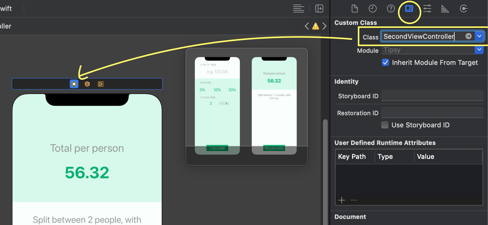
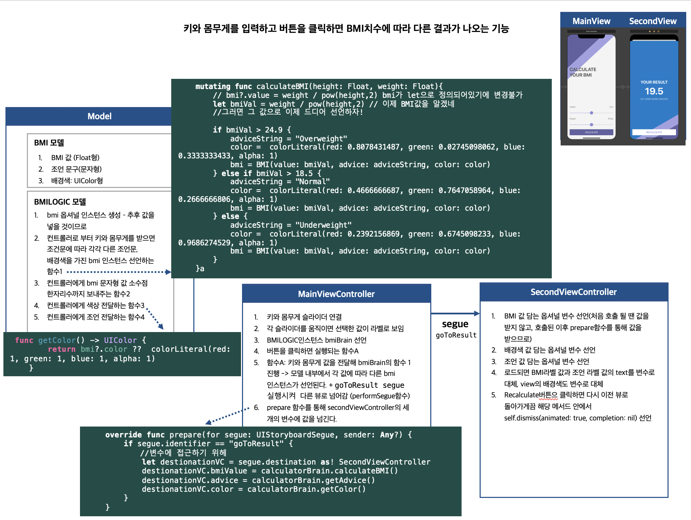

### TIL

- Angela Yu Swift ios 강의 학습 124 ~ 138
- 하나 이상의 View Controller를 서로 연결하는 방법 (코드를 통해 연결하는 방법과 segue를 이용해 연결하는 방법이 있음)

1. **스토리보드에 대한 접근 없이 새로운 뷰 컨트롤러를 연결하는 코드 작성**   <br>
→ SecondViewController.swift 파일 생성 후 새로운 뷰 컨트롤러 SecondViewController class 정의  <br> →
해당 컨트롤러의 viewDidLoad()함수에서 새로운 뷰에서 보여줄 라벨 등을 생성할 수 있음 <br> → 
라벨을 생성한 후에 view.addSubview(label)를 통해 해당 뷰에 라벨이 보이도록 설정  <br>→ 
메인 ViewController이 있는 파일로 이동. 원하는 행동(ex 버튼 누르면 뷰 이동)이 시작되면 시작되는 메서드 안에 SecondViewController의 인스턴스인 secondView 생성  <br>→
해당 뷰를 호출하기: self.present(이동할 뷰 이름(secondView), animated: true, completion: nil)을 하면 secondView 로 넘어간다. 
- 스토리보드에서 SecondViewController에서 보여주는 화면 뷰 컨트롤러의 클래스는 SecondViewController로 지정해줘야 함


    ```swift
    import UIKit
    class SecondViewController: UIViewController {
        var bmiValue = "0.0" //변수 선언
        override func viewDidLoad() {
            super.viewDidLoad()
            view.backgroundColor = .red
            //새로운 라벨 생성
            let label = UILabel()
            label.text = bmiValue
            label.frame = CGRect(x: 0, y: 0, width: 100, height: 50)
                    // SecondViewController가 가리키는 뷰에 label를 추가하겠다.
            view.addSubview(label) 
            
        }
    }
    ```
    ```swift
    @IBAction func calculatePressed(_ sender: UIButton) {
            let height = heightSlider.value
            let weigth = weightSlider.value
            let BMI = weigth / pow(height,2)
            let secondView = SecondViewController() //선언된 순간 만들어지는 것
            secondView.bmiValue = String(format: "%0.1f", BMI)
                    //secondView 뷰 호출
            self.present(secondView, animated: true, completion: nil)
        }

    ```

<br>

2. **segue 를 통해 연결 (스토리보드를 이용해 연결)**<br>
스토리보드에서 메인뷰컨트롤러 선택 후 컨트롤 키 누른 상태로 추후 이동시키고 싶은 Second뷰의 컨트롤러에 놓으면 **segue**가 생성됨 <br>→ segue 를 알아볼 수 있게 해주기 위해 이름(*identifier*) 작성 ex. goToResult <br>→
원하는 행동(ex 버튼 누르면 뷰 이동)이 시작되면 시작되는 메서드 안에서 **해당 segue 실행**하기. <br>
형태: performSegue(withIdentifier:sender:)
performSegue(segway이름:세그웨이를 시작하는데 사용할 객체) 

    ```swift
    @IBAction func calculatePressed(_ sender: UIButton) {
            let height = heightSlider.value
            let weight = weightSlider.value
            //인스턴스인 calculatorBrain에서 BMI 계산하는 함수 호출
            calculatorBrain.calculateBMI(height: height, weight: weight)
            //goToResult 세그웨이 시작 -> 즉 버튼 누르면 해당 세그웨이가 가리키는 뷰로 이동하게 된다
            self.performSegue(withIdentifier: "goToResult", sender: self)
        }
    ```

- 메인viewController를 통해 secondViewController 의 **프로퍼티 값을 변경하고 싶다면, 메인 뷰 파일에서 secondViewController의 변수에 접근해야 한다. 이를 가능하게 해주는 prepare 함수**

**prepare 함수는 segue가 실행될 때 호출되는 함수이다.** 즉 segue가 호출되는 즉시, 해당 segue의 식별이름(identifier)이 goToResult라면 해당 secondViewController의 프로퍼티에 접근할 수 있게 하는 코드 작성. <br> 
> secondViewController에 접근하기 위해선 **segue.destination를 사용해야 함.** 
**segue.destination은 secondViewController가 상속받고 있는 UIViewController 그 자체를 가리키므로 secondViewController에 접근하기 위해선 as를 사용해 downcasting(형변환)해야 한다.**

```swift
override func prepare(for segue: UIStoryboardSegue, sender: Any?) {
        if segue.identifier == "goToResult" {
            //변수에 접근하기 위헤
            let destionationVC = segue.destination as! ResultViewController 
            //해당 뷰컨트롤러의 프로퍼티인 bmiValue을 ~~으로 변경하겠다.
                        destionationVC.bmiValue = ~~
        }
    }
```

- 변수에 타입 선언 없이 default 값으로 0.0을 선언하면 **기본적으로 Double 형으로 인식**한다. Float형 변수로 선언하고 싶으면 타입을 Float 으로 선언해 줘야 함.
ex) var BMIValue : Float = 0.0
- **nil coalescing operator: 옵셔널변수 ?? 디폴트값**
→ 옵셔널 변수 값이 존재하면 해당 옵셔널을 언래핑한 값을 리턴하고, 옵셔널변수 값이 nil이면 디폴트값을 리턴함

```swift
var test: String?
test = "hello"
var hasValue: String = test ?? "none"
print(hasValue) //"hello"
test = nil
hasValue = test ?? "none"
print(hasValue) //"none"
```
