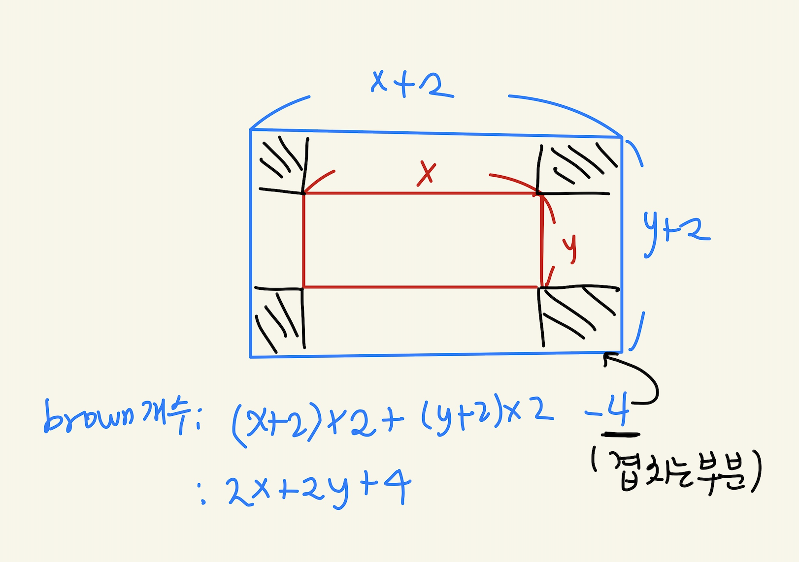

[문제 링크](https://programmers.co.kr/learn/courses/30/lessons/42842)

노란색 가로 길이가 x, 세로 길이 y라면 갈색 카펫이 가로 길이는 x+2, 세로 길이는 y+2가 된다.
따라서 먼저 가능한 (x,y) 조합 (x>=y)을 찾은 뒤 해당 x,y 로 구한 갈색 결자 개수가 brown과 일치하면 이를 답에 저장하는 방식으로 진행했다. 갈색 결자의 수 = 2x+2y+4

<p align="center">
    
</p>


#### **`- 내 풀이`**
```python
def solution(brown, yellow):
    answer = []
    for i in range(yellow,0,-1):
        # 이때 x 는 i, y는 yellow // i 가 된다.
        if yellow % i == 0 and i >= yellow // i and 2*i+2*(yellow // i)+4 == brown:
            answer = [i+2,yellow//i+2]
    return answer
```

#### `- 다른 사람 풀이`
```python
def solution(brown, red):
    for i in range(1, int(red**(1/2))+1): # 약수를 찾는 과정 (제곱근 수까지만 실행해도 찾을 수 있음)
        if red % i == 0: # red % i는 y가 되고, red // i 는 x가 된다.
            if 2*(i + red//i) == brown-4: # 2x+2y-4 = brown 개수와 일치하면 답이니까 리턴
                return [red//i+2, i+2]
```