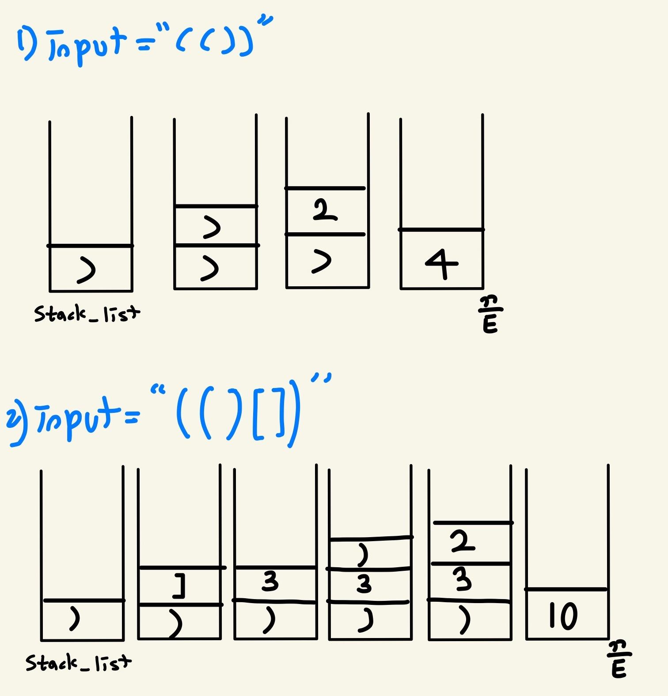

[문제 링크](https://www.acmicpc.net/problem/2504)

**문제 >**<br>
4개의 기호 ‘(’, ‘)’, ‘[’, ‘]’를 이용해서 만들어지는 괄호열 중에서 올바른 괄호열이란 다음과 같이 정의된다.<br>

한 쌍의 괄호로만 이루어진 ‘()’와 ‘[]’는 올바른 괄호열이다. <br>
만일 X가 올바른 괄호열이면 ‘(X)’이나 ‘[X]’도 모두 올바른 괄호열이 된다. <br>
X와 Y 모두 올바른 괄호열이라면 이들을 결합한 XY도 올바른 괄호열이 된다.<br>
예를 들어 ‘(()[[]])’나 ‘(())[][]’ 는 올바른 괄호열이지만 ‘([)]’ 나 ‘(()()[]’ 은 모두 올바른 괄호열이 아니다. 우리는 어떤 올바른 괄호열 X에 대하여 그 괄호열의 값(괄호값)을 아래와 같이 정의하고 값(X)로 표시한다. 

‘()’ 인 괄호열의 값은 2이다.<br>
‘[]’ 인 괄호열의 값은 3이다.<br>
‘(X)’ 의 괄호값은 2×값(X) 으로 계산된다.<br>
‘[X]’ 의 괄호값은 3×값(X) 으로 계산된다.<br>
올바른 괄호열 X와 Y가 결합된 XY의 괄호값은 값(XY)= 값(X)+값(Y) 로 계산된다.<br>
예를 들어 ‘(()[[]])([])’ 의 괄호값을 구해보자. ‘()[[]]’ 의 괄호값이 2 + 3×3=11 이므로 ‘(()[[]])’의 괄호값은 2×11=22 이다. 그리고 ‘([])’의 값은 2×3=6 이므로 전체 괄호열의 값은 22 + 6 = 28 이다.

여러분이 풀어야 할 문제는 주어진 괄호열을 읽고 그 괄호값을 앞에서 정의한대로 계산하여 출력하는 것이다. 

----
**풀이 >** <br>
')', ']' 를 만나면 일단 stack_list 에 저장하고, 추후 '(', '[' 를 만날 때 값을 계산하는 방식으로 진행했다.<br>
만약 '(()[])'와 같이 중첩된 괄호문을 만날 경우, () 를 닫을 때 안의 값 ()[](값=5)에 2배를 진행해야 하므로, 이를 위해 괄호 값도 stack_list에 추가했다.

<p>
    
</p>


즉 '()'가 입력으로 들어면 추후 stack_list에 )만 있으므로 이를 계산한 뒤 끝이 나지만
'(())'가 입력으로 들어옴녀 추후 stack_list에 ), 2가 있으므로 숫자에 2를 곱하여 계산을 진행했다.


')', ']' 기호를 만나면 추후 이를 닫아주는 괄호인 '(', '['를 만나야 하므로 각 기호들이 만나야 하는 기호 관련 리스트를 prev_list에 저장했다.<br>
따라서 추후 '(', '[' 등을 만났을 때 prev_list의 마지막 원소와 일치해야, 올바른 괄호열이라는 것을 알 수 있다.
만약 일치하지 않는다면 사용자에게 입력받은 값을 빈 배열로 만들고, stack_list도 빈 배열로 만든다음 리턴하여 계산을 종료했다.


#### `- 내 풀이`


```python
value_list = list(input())
stack_list = [] # ']',')' 및 숫자 등을 저장하는 리스트
prev_list = [] # 이전 기호들(']',')')을 저장하는 리스트

def check(val_list):
  global stack_list,prev_list,value_list
  prev_dic = {")":"(","]":"["} # )를 만나면 추후 만나야 하는 기호가 ( 니까 이를 키-값 형태로 저장함

  val = val_list.pop()
  if val == ")" or val == "]":
    stack_list.append(val)
    prev_list.append(prev_dic[val]) #올바른 괄호열 매치 위해 사용
    return
  if val == "(" and len(prev_list)> 0 and val == prev_list.pop(): # 올바른 괄호열인지 체크
    stack_val = stack_list.pop()
    if str(stack_val).isdigit(): # 만약 숫자가 있다면 연속된 모든 숫자를 계산한 다음 이에 2를 곱하여 다시 push 해주기
      while len(stack_list)>1 and str(stack_list[-1]).isdigit():
        stack_val += stack_list.pop()
      stack_list.pop() # ) 기호도 제거해야 하므로
      stack_list.append(stack_val * 2)
    else:
      stack_list.append(2) # 만약 연속된 괄호열이 아니라면 stack_list에 2 값만 추가
  elif val == "[" and len(prev_list)> 0 and prev_list.pop() == val:
    stack_val = stack_list.pop()
    if str(stack_val).isdigit(): # 만약 숫자가 있다면 연속된 모든 숫자를 계산한 다음 이에 3를 곱하여 다시 push 해주기
      while len(stack_list)>1 and str(stack_list[-1]).isdigit():
        stack_val += stack_list.pop()
      stack_list.pop()# ] 기호도 제거해야 하므로
      stack_list.append(stack_val * 3)
    else:
        stack_list.append(3)
  else: # 괄호열이 올바르지 않은 경우
      value_list = []
      stack_list = []
      return     

while len(value_list) > 0:
  check(value_list)

try: # 괄호열이 올바른 경우, stack_list에 숫자만 남게 된다.
  print(sum(stack_list))
except:
  print(0)
```
