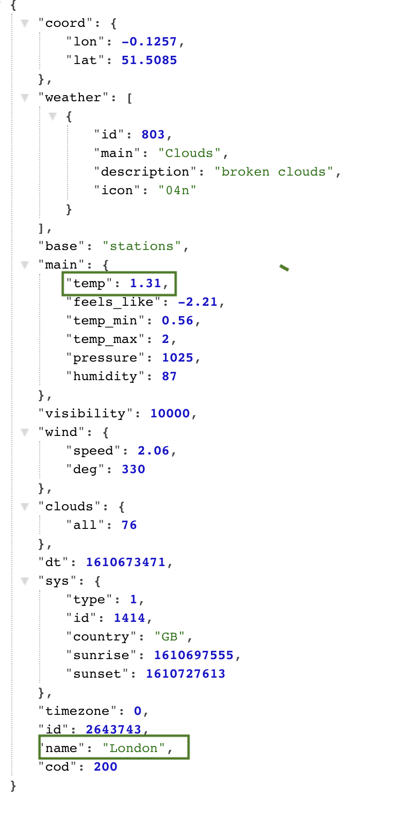

### TIL

- Angela Yu Swift ios 강의 학습 151 ~ 158
- JSON Formatter(크롬 익스텐션) JSON data 보기 편하게 정렬해줌
- 외부 API를 통해 데이터를 요청하고 해당 데이터를 표시하는 방법 (URLSession)
- 열혈 C자료구조 스택 ADT, 배열 기반 구현

---
### **외부 API를 통해 데이터를 요청하고 해당 데이터를 표시하는 방법**
→ URLSession을 통해 작업을 요청하고 응답받기<br>
→ 응답받은 데이터 디코딩하기<br>
→ 디코딩한 데이터 뷰 컨트롤러에게 넘기기<br>
→ 뷰 컨트롤러에서 받은 데이터 UI에 보여주기
<br><br>
> **URLSession을 통해 작업을 요청하고 응답받기**

**1. URL생성**

**2. URLSession 생성**

**3. URLSession에 작업 요청하기(dataTask)**

- 형태: func dataTask(with url: URL, completionHandler: @escaping (Data?, URLResponse?, Error?) -> Void) -> URLSessionDataTask

- **dataTask 함수**: 특정 URL 주소를 받았을 때, task를 생성한다. 그리고 완료되면 handler 호출 → task를 만들기만 했으므로, 시작하려면 resume()으로 호출해야 함. 

- **completionHandler** → 요청에 대한 응답을 반환받은 순간 알려준다. 해당 클로저는 data 객체, URLResponse객체, Error 객체 총 3개의 파라미터가 있다. 

- **data 객체** → 요청한 데이터가 잘 들어왓는지 체크 가능 → **해당 데이터는 JSONDecoder를 통해 디코딩 작업을 거쳐야 한다. →** parseJSON함수 호출해서 해당 함수에서 디코딩한 후 해당 정보들로 정의한 객체 전달 받기
- **response 객체**→ http상태, header field등에 대한 정보를 알 수 있음
- **error 객체** → 에러에 대한 정보를 담고 있음

**4. resume()호출을 통해 작업 시작하기**
<br><br>
> **응답받은 데이터 디코딩하기**

- JSONDecoder: JSON 개체에서 데이터 유형의 인스턴스를 디코딩하는 객체
- api 호출 시 받는 **데이터와 같은 형태의 구조체를 작성**해야 한다. 해당 구조체는 추후 전달받은 데이터를 디코딩할 때 사용된다. **구조체를 이용해 디코딩 한 결과로 해당 구조체 형태를 지닌 객체를 받게 된다.** 해당 객체를 통해 원하는 값에 접근할 수 있다.<br>
아래와 같은 형태로 데이터를 전달해주는 API 에서 name 값과 main안에 있는 temp 값을 받아오고 싶다고 가정하자. 
<p align="center">

</p>
다음으로 구조체에서 변수명을 API 에서 명시한 변수명과 동일하게 작성해야 한다.

```swift
//Codable프로토콜은 사용자 정의 데이터 포멧을 인코딩, 디코딩 하는데 사용됨
struct WeatherData: Codable {
    let name: String
    let main: Main
}

struct Main: Codable {
    let temp: Double
}
```

<br>
-  [ 응답받은 데이터 디코딩하기 ] 코드

```swift
//디코딩하는 작업
// parseJSON를 통해 얻어온 데이터 -> 원하는 데이터 추출 -> 해당 데이터로 객체 생성해서 다시 넘겨주기
    func parseJSON(_ weatherData: Data) -> WeatherModel? {
        let decoder = JSONDecoder()
        do {
            // decode함수는 에러핸들링 필요
            let decodedData = try decoder.decode(WeatherData.self, from: weatherData)
            let temperature = decodedData.main.temp
            let cityName = decodedData.name
            let weather = WeatherModel(temp: temperature, name: cityName)
            return weather
        } catch {
            return nil //error발생할 경우 nil을 리턴해야하기 때문에 리턴 값 WeatherModel옵셔널로 정의
        }
    }
```

> **디코딩한 데이터 뷰 컨트롤러에게 넘기기**<br>디코딩작업이 끝나 생성된 WeatherModel 객체는 dataTask함수 내부로 다시 전달된다. 이후 해당 객체를 UI화면과 연결된 뷰컨트롤러에게 넘길려면 어떻게 해야할까

1. WeatherManager 구조체 내부에서 해당 객체를 넘겨줄 뷰컨트롤러의 인스턴스를 생성하고 해당 인스턴스에 있는 함수(changeWeather)에게 파라미터로 객체를 넘겨준다

    **BUT 그러면 WeatherManager 내부가 변경된다.** 만약 다른 뷰컨트롤러에서도 요청하면 계속 내부가 변경된다. 그러면 재사용성이 떨어진다. → delegate를 통해 객체를 넘겨주는 함수를 위임하면  새로운 뷰 컨트롤러가 객체를 요청해도 WeatherManager 모델 내부는 차이가 없어진다.

    WeatherManager 내부에서 delegate?.함수를 통해 객체 값을 넘겨주기 때문에 변경이 없는 것이다. 누가 delegate 를 위임받는지는 알 필요가 없는 것이다. 

2. WeatherDelegateProtocol을 따르는 옵셔널 delegate 변수 선언. → WeatherDelegateProtocol 내부에 객체를 넘겨주는 함수 파라미터까지 정의

```swift
if let safeData = data {
    //weatherData? 옵셔널 바인딩을 통해 풀어주기
    if let weatherData = self.parseJSON(safeData){
    /* 1번 방법. 이렇게 선언하면 재사용성이 떨어진다.
    let weatherVC = WeatherViewController()
    weatherVC.changeWeather(weather: weatherData)
    */

    // 2번 방법 (첫 번째 파라미터: 호출한 객체, 두번쨰 파라미터 전달할 객체
    // 대체로 delegate에서 첫번째 인자는 호출한 객체를 넣는편
    delegate?.changeWeather(self, weather: weatherData)
        }
    }
```

> **뷰 컨트롤러에서 받은 데이터 UI에 보여주기** <br>이제 UI와 연결된 뷰 컨트롤러의 내부에서 delegate를 선언하고 나면 changeWeather함수를 통해 객체를 전달받게 된다. 그런데 마지막 문제가 있다.

→  앞서 dataTask함수의 completionHandler를 통해 데이터를 받고, 해당 데이터를 디코딩한 객체를 전달받았다. 또한 이 안에서 delegate 를 통해 뷰컨트롤러에게 객체를 전달했다. 

해당 completion closure는 IOS에 의해 **background queue에서 호출되는 것이다. 그런데 뷰 컨트롤러에서 UI에 표시하는 작업은 main dispatch queue에서 일어나야 한다.** 즉 main queue에서 사용자 입력에 대응하는 UI를 그려준다. 그러면 뷰 컨트롤러의 함수 안에서 main  dispatch queue 호출해, 이를 통해 UI 업데이트하면 이를 해결할 수 있다.

```swift
func changeWeather(_ weatherManager: WeatherManager, weather: WeatherModel) {
        DispatchQueue.main.async {
            self.temperatureLabel.text = weather.tempByDecimal
            self.conditionImageView.image = UIImage(systemName: weather.getConditionName)
            self.cityLabel.text = weather.name
        }
```

- WeatherManager.swift 전체 코드

```swift
protocol WeatherDelegateProtocol {
     //첫번째 파라미터는 호출할 때 이름 없이 바로 넣을 수 있게
     func changeWeather(_ weatherManager: WeatherManager,weather: WeatherModel)
     func didFailError(_ error: Error)
}
struct WeatherManager {
    var urlStart: String = "https://api.openweathermap.org/data/2.5/weather?appid=sercret&units=metric"
    //뷰 컨트롤러로부터 사용자에게 입력받은 값 전달 받음
    func fetchURL(cityName: String){
        let getURL = "\(urlStart)&q=\(cityName)"
        performRequest(with: getURL)
    }
    //재사용성을 높이기 위해 delegate 사용
    var delegate: WeatherDelegateProtocol?
    func performRequest(with urlString: String){
        //1. create a URL
        if let url = URL(string: urlString){
            //2. create a urlSession
            let session = URLSession(configuration: .default)
            //3. give the session a task
            let task = session.dataTask(with: url) { (data, urlResponse, error) in
                if error != nil {
                    delegate?.didFailError(error!) //호출 에러 보여줘라~ 어디서? 뷰에서~ 사용자에게 어떤 에러인지 알려줘야지!
                    return
                }
                if let safeData = data {
                    //weatherData? 옵셔널 바인딩을 통해 풀어주기
                    if let weatherData = self.parseJSON(safeData){
                        /* 이렇게 선언하면 재사용성이 떨어진다.
                        let weatherVC = WeatherViewController()
                        weatherVC.changeWeather(weather: weatherData)
                        */
                        delegate?.changeWeather(self, weather: weatherData)
                    }
                }
            }
            //4. start the task
            task.resume()
        }
    }
    
    // parseJSON를 통해 얻어온 데이터 -> 원하는 데이터 추출 -> 다시 넘겨주기
    func parseJSON(_ weatherData: Data) -> WeatherModel? {
        let decoder = JSONDecoder()
        do {
            let decodedData = try decoder.decode(WeatherData.self, from: weatherData)
            let temperature = decodedData.main.temp
            let id = decodedData.weather[0].id
            let cityName = decodedData.name
            let weather = WeatherModel(temp: temperature, name: cityName, id: id)
            return weather
        } catch {
            delegate?.didFailError(error)
            return nil //error발생할 경우 nil을 리턴해야하기 때문에 WeatherModel옵셔널로 정의
        }
    }

}
```

---
출처 ) [Udamy Angela Yu Swif 강의](https://www.udemy.com/course/ios-13-app-development-bootcamp)

참조 1) [https://www.freecodecamp.org/news/how-to-make-your-first-api-call-in-swift/](https://www.freecodecamp.org/news/how-to-make-your-first-api-call-in-swift/)

참조 2) [https://dev.to/grigordochev/how-to-parse-json-data-from-api-with-swift-5-33bd](https://dev.to/grigordochev/how-to-parse-json-data-from-api-with-swift-5-33bd)

참조 3)[https://learnappmaking.com/urlsession-swift-networking-how-to/](https://learnappmaking.com/urlsession-swift-networking-how-to/)

**참조 4)[https://medium.com/@sidhdeshvadgaonkar_1737/fetching-data-from-api-passing-to-view-controllers-using-completion-handlers-and-populating-data-2c771d853a6d](https://medium.com/@sidhdeshvadgaonkar_1737/fetching-data-from-api-passing-to-view-controllers-using-completion-handlers-and-populating-data-2c771d853a6d)**

**참조5) [https://www.donnywals.com/appropriately-using-dispatchqueue-main/](https://www.donnywals.com/appropriately-using-dispatchqueue-main/)**