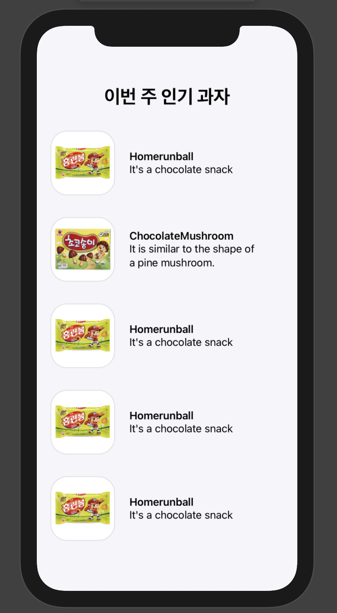

### 2021/01/17(일)
---


- [Angela Yu Swift ios 강의 학습](https://www.udemy.com/course/ios-13-app-development-bootcamp/) (178~ 189)
    - firebase를 이용한 유저 등록, 로그인, 로그아웃 
    - Constants.swift 파일을 이용해 반복되는 문자열은 클래스 변수에 담아 재사용(static let)
    - UITableViewDataSource를 통해 각 셀에 원하는 데이터 표시
- customTableView 만들어서, 이미지와 라벨 한 셀에 함께 보여주기
- [운영체제 인프런 강의 학습(프로세스의 이해)](https://www.inflearn.com/course/%EC%9A%B4%EC%98%81%EC%B2%B4%EC%A0%9C-%EA%B3%B5%EB%A3%A1%EC%B1%85-%EC%A0%84%EA%B3%B5%EA%B0%95%EC%9D%98/)

[학습자료) customTableView](https://yucaroll.tistory.com/3)

[학습자료) customTableView2](https://stackoverflow.com/questions/24170922/creating-custom-tableview-cells-in-swift/36426858#36426858)


### 2021/01/19(화)
---
- Angela Yu Swift ios 강의 학습 194 ~ 204
- CS50 코칭스터디 과제
- ViewControllerLifestyle 정리

### 2021/01/20(수)
---
- [도서- 쉽게 배우는 운영체제] 개요 부분 학습 (운영체제의 역할 및 구조)
- [도서- 윤성우의 열혈 자료구조] - 스택을 이용한 계산기 프로그램 부분 실습
- Angela Yu Swift ios 강의 학습 205 ~ 215
- swiftUI 연습(ZStack, HStack, VStack, Extract SubView)

>SwiftUI 연습

<p align="center">

</p>


```swift
import SwiftUI

struct SnackView: View {
    var body: some View {
        ZStack{
            //배경색 지정
            Color(red: 0.96, green: 0.96, blue: 0.98)
                .ignoresSafeArea()
            VStack(alignment: .center, spacing: 5){
                Text("이번 주 인기 과자")
                    //폰트 사이즈 조정
                    .font(.system(size: 30))
                    //폰트 굵기 조정
                    .fontWeight(.heavy)
                    //위아래양옆에 padding 부여
                    .padding()
                EachSnack(snackName: "Homerunball",description:"It's a chocolate snack")
                EachSnack(snackName: "ChocolateMushroom", description:"It is similar to the shape of a pine mushroom.")
                EachSnack(snackName: "Homerunball",description:"It's a chocolate snack")
                EachSnack(snackName: "Homerunball",description:"It's a chocolate snack")
                EachSnack(snackName: "Homerunball",description:"It's a chocolate snack")
            }
        }
    }
}

//이 부분을 통해 xcode에서 오른쪽 화면에 실시간으로 ui가 변경되는 모습을 보여줌
struct Navigation_Previews: PreviewProvider {
    static var previews: some View {
        SnackView()
    }
}

struct EachSnack: View {
    var snackName: String
    var description: String
    var body: some View {
        HStack{
        Image(snackName)
            //이미지 사이즈 변경 가능하도록
            .resizable()
            //화면에 딱 맞게
            .aspectRatio(contentMode: .fit)
            //모서리 약간 둥글게
            .cornerRadius(25)
            .frame(width: 100)
            .padding()
            //그림자 효과
            .shadow(radius: 1)
            VStack(alignment: .leading, spacing: nil){
                Text(snackName)
                    .bold()
                    .frame(alignment: .leading)
                Text(description).frame(maxWidth: 200, alignment: .leading)
            }
        }
        .frame(width: 400, alignment: .leading)
    }
}

```