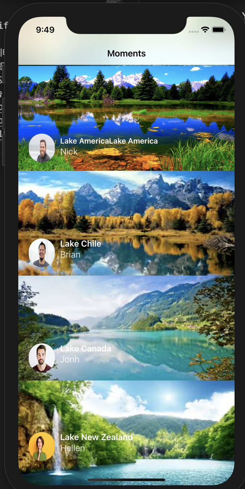
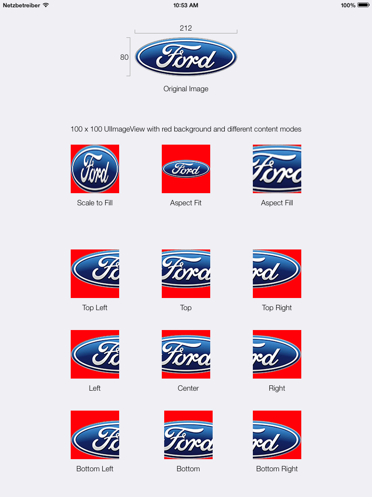
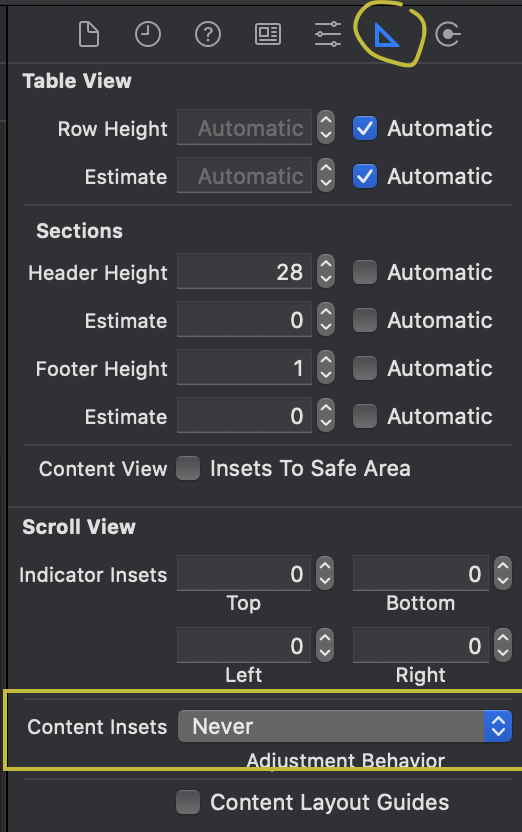

### TIL
- [도서-  쉽게 배우는 운영체제] 챕터5 프로세스 간 통신, 공유자원과 임계구역, 임계구역 해결 방법
- Angela Yu Swift ios 강의 학습 261~ 268
    - Realm 데이터베이스를 사용하여 CRUD 및 쿼리문 사용하는 방법
- UITableView & TableViewCell Customizing 연습 [깃헙 소스코드](https://github.com/osandra/IOS_Practice/commit/5c1c205060cfd518174a69fb74ecf5c38f67fce4)
    

    
    

- 헤맸던 부분: 각 셀에서 배경이미지 크기가 제각각으로 나온 것 →  
1. 백그라운드 이미지를 감싼 View 생성해서 Constraints 위아래양옆 0 0 0 0 주기
2. 해당 이미지 뷰 또한 Constraints 0 0 0 0 주고 높이 200으로 제한
3. 해당 이미지뷰..contentMode = .scaleToFill해서 해당 영역에 가득 채우기
    - .scaleToFill: 이미지 공간에 맞게 위아래로 늘어나서 이미지 비율이 왜곡될 수 있음
    - .scaleAspectFit: 원래 사진의 가로와 세로 비율을 유지하며 이미지를 최대한 크게 늘림.
    - .scaleAspectFill: 뷰
    원래 가로 세로 비율 유지하면서 이미지를 확장하지만, 이미지를 공간에 가득채우기 위해 특정 부분이 잘릴 수 있음.

    |  |
    |:--:| 
    | [사진 출처](https://stackoverflow.com/questions/4895272/difference-between-uiviewcontentmodescaleaspectfit-and-uiviewcontentmodescaletof) |
    
- tableView 맨 밑에 생기는 빈 공간 없애기 →  메인 스토리보드에서 Contetn Insets : Never로 변경

[ref 1) Slidemenu project 16](https://github.com/allenwong/30DaysofSwift)

[ref 2) aspect Fill, Aspect Fit 차이](https://www.hackingwithswift.com/example-code/uikit/how-to-adjust-image-content-mode-using-aspect-fill-aspect-fit-and-scaling)