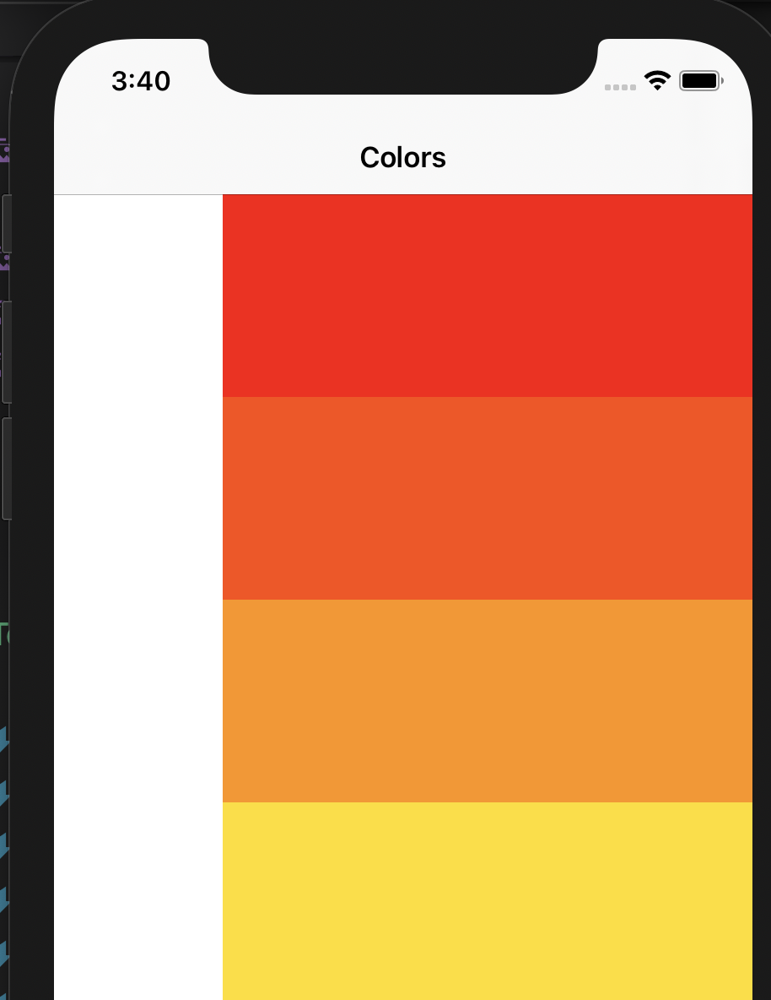
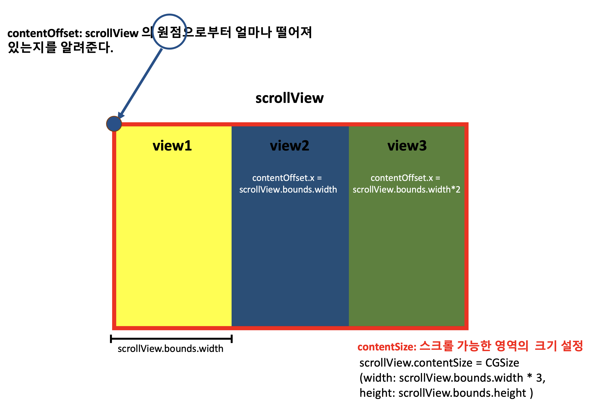
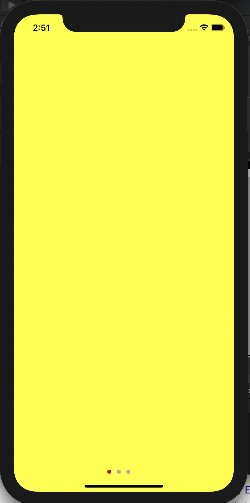
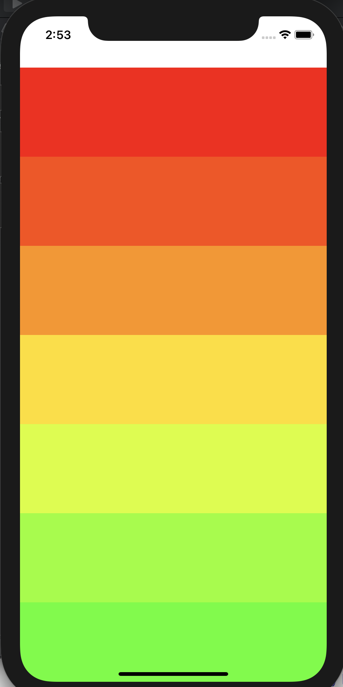

### TIL

- [도서-  쉽게 배우는 운영체제] 챕터 2 학습(컴퓨터 기본 구성, cpu와 메모리, 병렬처리 개념)
- [도서- 윤성우의 열혈 자료구조] - 원형 큐의 배열기반 구변
- Angela Yu Swift ios 강의 학습 216 ~ 232
    - swiftui에서 api를 통해 받은 데이터를 표시하는 법

- **ScrollView 연습**

    - **contentOffset**: **스크롤 뷰의 원점으로부터** 얼마나 떨어져있는지를 알려준다. 즉 유저가 화면을 스크롤할 때마다 해당 값은 변한다.
    - **contentSize**: UIScrollView를 얼마나 스크롤 할 수 있는지 알려준다. **즉 스크롤 가능한 영역의 크기를 설정하는 데 사용된다.** 
    contentSize가 UIScrollView의 프레임 크기보다 클 때 스크롤이 가능하다.
        ```swift
        scrollView.contentSize = CGSize(width: scrollView.bounds.width * 3, height: scrollView.bounds.height )
        ```
        위에서 scrollView의 스크롤 가능 영역을, 본래 스크롤 뷰 너비의 3배로 지정했으니 해당 레이아웃은 본래 너비의 3배까지 스크롤 할 수 있다.
    - **contentInset**: 스크롤 뷰로부터 컨텐츠가 안 쪽으로 얼마나 들어가는지 조정할 수 있다.
        ```swift
        scrollView.contentInset = UIEdgeInsets(top: 0, left: 100, bottom: 0, right: 0)
        ```
        <p align="center">
        
        </p>

    - **setContentOffset**: 특정 contentOffset으로 스크롤 설정(이동)할 수 있다.

<br>


    


- ScrollView 연습1 : 옆으로 스크롤이 가능하고 아래의 page Control을 통해 현재의 위치를 알 수 있는 형태
<p align="center">
    
</p>

```swift
import UIKit

class PagingViewController: UIViewController, UIScrollViewDelegate {
    
    @IBOutlet weak var pagingScrollView: UIScrollView!
    
    //pageControl 인덱스 0부터 시작
    @IBOutlet weak var pageControl: UIPageControl!
    override func viewDidLoad() {
        super.viewDidLoad()
        pagingScrollView.delegate = self
        //pageControl는 총 3페이지
        pageControl.numberOfPages = 3

        let pageWidth = pagingScrollView.bounds.width
        let pageHeight = pagingScrollView.bounds.height
        pagingScrollView.contentSize = CGSize(width: pageWidth*3, height: pageHeight)
        //isPagingEnabled: 스크롤 보기에 대해 페이징을 사용할지 여부를 결정
        pagingScrollView.isPagingEnabled = true
        pagingScrollView.showsHorizontalScrollIndicator = false
        
        let view1 = UIView(frame: CGRect(x: 0, y: 0, width: pageWidth, height: pageHeight))
        view1.backgroundColor = UIColor.yellow
        let view2 = UIView(frame: CGRect(x: pageWidth, y: 0, width: pageWidth, height: pageHeight))
        view2.backgroundColor = UIColor.blue
        let view3 = UIView(frame: CGRect(x: pageWidth*2, y: 0, width: pageWidth, height: pageHeight))
        view3.backgroundColor = UIColor.green
    
        pagingScrollView.addSubview(view1)
        pagingScrollView.addSubview(view2)
        pagingScrollView.addSubview(view3)      
    }
    //UIPageControl 클릭 시 해당 페이지로 이동
    @IBAction func pageChange(_ sender: UIPageControl) {
        let xOffset = pagingScrollView.bounds.width * CGFloat(pageControl.currentPage)
        //스크롤뷰를 해당 좌표로 이동(스크롤뷰의 원점으로부터 x축으로 xOffset만큼)
        pagingScrollView.setContentOffset(CGPoint(x: xOffset,y: 0) , animated: true)
    }
    //scrollViewDidEndDecelerating: 스크롤 움직임이 한 번 끝날 때마다 알려줌
    func scrollViewDidEndDecelerating(_ scrollView: UIScrollView) {
        //사용자가 한 번 스크롤하면, pageControl의 현재 페이지도 현재 위치에 맞게 변경
        pageControl.currentPage = Int(pagingScrollView.contentOffset.x / (pagingScrollView.bounds.width))
    }
}
```

- ScrollView 연습2 : 아래로 스크롤이 가능한 형태
<p align="center">
    
</p>

```swift
import UIKit

class ViewController: UIViewController {
    @IBOutlet weak var scrollView: UIScrollView!
    override func viewDidLoad() {
        super.viewDidLoad()
        let contentWidth =  scrollView.bounds.width
        let contentHeight = scrollView.bounds.height * 3
        //스크롤뷰의 높이를 원래 기종 높이의 세 배로 지정
        scrollView.contentSize = CGSize(width: contentWidth, height: contentHeight)
        //CGFloat → 32비트 시스템에서는 float, 64비트 시스템에서는 double형이 될 수 있음
        let subviewHeight = CGFloat(120)
        var currentViewOffset = CGFloat(0)
        while currentViewOffset < contentHeight {
            //frame의 형태: 시작위치 (0,currentViewOffset)으로부터, 너비(화면 너비만큼) 높이 120
            let frame = CGRect.init(x: 0, y: currentViewOffset, width: contentWidth, height: subviewHeight)
            //해당 프레임으로 하나의 subview생성
            let subview = UIView(frame: frame)
            let hue = currentViewOffset / contentHeight
            subview.backgroundColor = UIColor(hue: hue, saturation: 1, brightness: 1, alpha: 1)

            //스크롤 뷰에 해당 뷰 덧붙임
            scrollView.addSubview(subview)
            //subview의 높이만큼 currentViewOffset에 더하기. 
            //다음 만들어지는 뷰 frame의 y값 = 직전에 만들어진 뷰 frame의 y값 + 이전 뷰 높이(120)임
            currentViewOffset += subviewHeight
        }
    }
}
```

[ref 1) scroll view practice](https://guides.codepath.com/ios/Scroll-View-Guide)

[ref 2) contentOffset](https://levelup.gitconnected.com/what-exactly-are-contentoffset-contentinset-and-contentsize-of-a-uiscrollview-960207c75b88)

[ref 3) UIPageControl](https://www.journaldev.com/22847/ios-uipagecontrol)