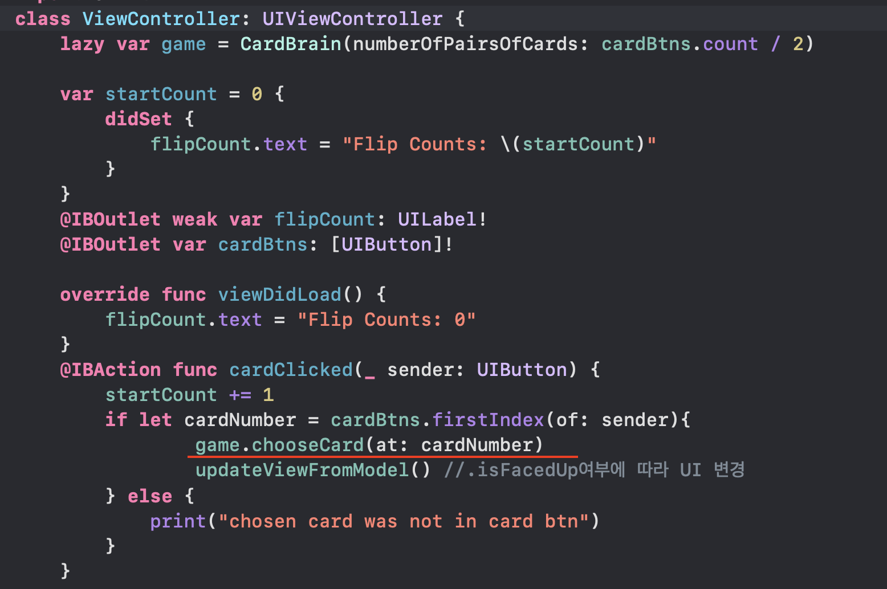

### TIL

- [stanfordcs193p ios11 강의 2강](https://www.edwith.org/swiftapp/lecture/26620/)
    - lazy 키워드를 통해 선언한 속성(프로퍼티)는 처음 사용할 때 초기화 됨
    ```swift
        // 에러 발생 코드
        var game = CardBrain(numberOfPairsOfCards: cardBtns.count / 2)

        // 따라서 lazy를 사용 -> lazy로 선언한 속성은 처음 사용할 때 초기화되므로 다른 프로퍼티를 사용할 수 있다. 
        lazy var game = CardBrain(numberOfPairsOfCards: cardBtns.count / 2)

    ```
    game을 처음 쓸 떄 초기화 프로세스가 진행되는데, CardBrain에 들어가는 값에 프로퍼티 및 변수가 들어가면 해당 프로퍼티(변수)도 초기화가 진행된 상태가 아니라서 에러가 발생. 즉 game 변수를 초기화하려는 와중에 다른 한 변수 또한 초기화하려고 하기 때문에 에러가 발생

    var game = CardBrain(numberOfPairsOfCards: cardBtns.count / 2) <br>라고 작성하면 아래와 같은 에러 메시지가 나온다. <br>
    <div style="color: #ee5253; margin-bottom: 10px; font-weight: 600; border-radius: 10px;">
    Cannot use instance member 'cardBtns' within property initializer; property initializers run before 'self' is available
    </div>

    즉 인스턴스 프로퍼티인 game을 이니셜라이징할 때 다른 인스턴스 프로퍼티인 cardBtns룰 사용할 수 없다는 말이다.
    game을 이니셜라이징 하는 것이 cardBtns 프로퍼티를 갖고 있는 클래스 ViewController가 선언되기 전에 발생하기 때문에 에러가 발생하는 것이다.

    **그러므로 이를 해결하는 방법 중 하나는 game변수의 이니셜라이징을 선언 당시가 아닌, game을 처음 사용(액세스)할 때 초기화하게 해주는 lazy 키워드로 선언하면 된다.**

    game을 lazy 키워드(게으른 저장 프로퍼티)로 선언하면, 추후 game의 프로퍼티에 접근할 때 game이 이니셜라이징 된다. 그 땐 cardBtns 또한 이니셜라이징 된 상태이므로 해당 코드의 에러가 발생하지 않는 것이다.

    <div align="center">
    
    </div>
    
    이와 같은 에러의 예시로, 아래와 같은 코드로 작성한다면 동일한 오류가 발생한다.
    ```swift
    class ViewController: UIViewController {
        var item1 = 7
        var item2 = 15
        var newval = [item1, item2] 
    }
    ```
    따라서 newval을 lazy로 선언해 첫 사용시 초기화 한다면 에러가 발생하지 않을 것이다.
    ```swift
    class ViewController: UIViewController {
        var item1 = 7
        var item2 = 15
        lazy var newval = [item1, item2]

        override func viewDidLoad() {
        print(newval.first ?? 0) //이 때 newval 초기화
        }
    }
    //실행 시 7출력
    ```


   ---
    - 타입 메소드 및 타입 프로퍼티를 사용해, 생성하는 객체에 Unique ID값을 넘겨주기
    ```swift
    struct Card {
        var isFacedUp = false
        var isMatched = false
        var ID: Int = 0

        //타입 프로퍼티
        static var IDSet: Int = 0

        //타입 메서드
        static func makeID() -> Int {
            IDSet += 1
            return IDSet
        }
        // 추후 다른 클래스에서 카드 객체를 생성할 때 입력받을 건 없고, 해당 카드의 아이디를 자동으로 리턴.
        init(){
            //Card.makeID()를 실행할 때마다 기존 IDSet 값보다 1 큰 숫자를 리턴
            //즉 매번 카드를 생성할 때마다 해당 카드는 다른 ID값을 갖게 됨. 
            self.ID = Card.makeID()
        }
    }

    ```