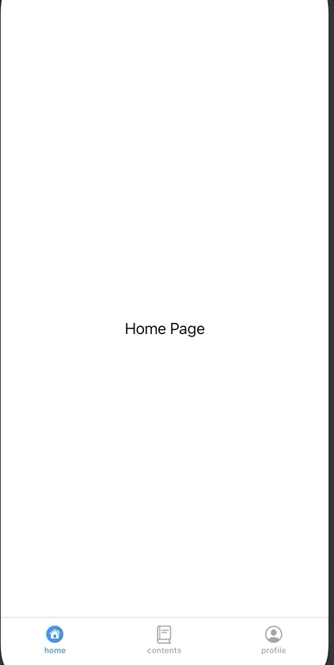
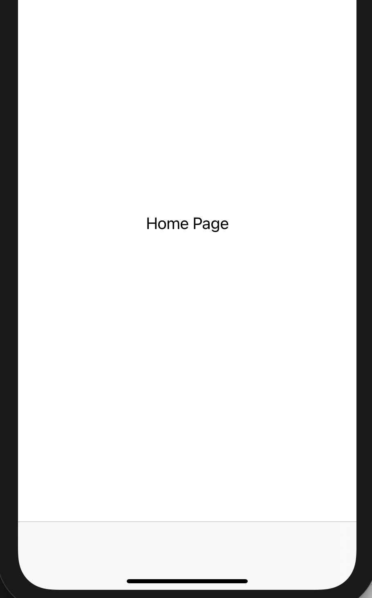
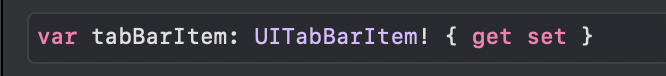
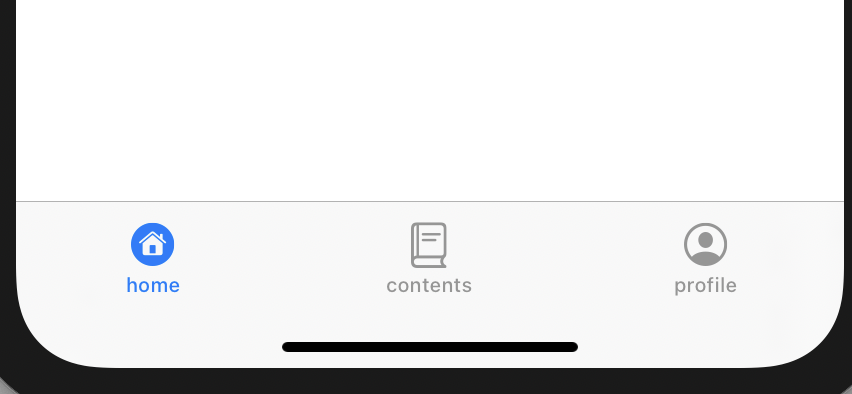

### TIL
- [도서- 쉽게 배우는 운영체제] 챕터6 교착상태 해결방법, 다중 자원과 교착 상태 검출
- [도서- 윤성우의 열혈 자료구조] 챕터8 수식 트리 구현
- UITabBarController 연습 [깃헙링크](https://github.com/osandra/IOS_Practice/commit/902eaeee66898fb39496d236d094bb60ad5ff909)

<div align="center">

</div>

---

### **UITabBarController**
UITabBarController는 여러 개의 뷰 컨트롤러를 담고 있고, 이를 스크린 하단에 탭으로 표시한다. <br>
사용자가 해당 탭을 선택하면 해당 뷰 컨트롤러로 이동하게 된다.

UITabBarController 가 처음에 표시할 뷰 컨트롤러는 두 가지 방법으로 지정할 수 있다. 
1. index를 통해 지정
2. 직접 뷰 컨트롤러 이름으로 지정
```swift
class TapBarController: UITabBarController {

    override func viewDidLoad() {
        super.viewDidLoad()
        let homeVC = UINavigationController.init(rootViewController: HomeViewController())
        let secondVC = UINavigationController.init(rootViewController: SecondTableViewController())
        let thirdVC = UINavigationController.init(rootViewController: ThirdViewController())
        // 탭바에 3개의 뷰 컨트롤러가 들어가고, 각 탭을 탭할 때 해당 뷰로 이동
        self.viewControllers = [homeVC, secondVC, thirdVC] //tapbarController가 가지는 뷰 컨트롤러 그룹
        // homeVc의 index: 0, secondVc: 1, thirdVC는 2번 (배열에 추가한 순서대로)

        // 1. index를 통해 지정하는 방법: selectedIndex사용
        // selectedIndex: 현재 선택한 탭 항목과 연결된 뷰 컨트롤러의 인덱스 지정
        // self.selectedIndex = 0  -> index값이 0인 homeVC를 처음에 표시하겠다.

        // 2. 직접 뷰 컨트롤러 이름으로 지정하는 방법
        self.selectedViewController = homeVC
	}
}
```
위와 같이 연결만 하면 하단 탭에 아무것도 보이지 않는다. 
<div align="center">

</div>
아직 각 뷰컨트롤러의  .tabBarItem값을 배정하지 않았기 때문이다. tabBarItem은 탭 표시줄에서 해당 뷰컨트롤러를 나타내는 부분이다.
<div align="center">

</div>
따라서 각 뷰컨트롤러에 UIBarItem을 배정해주기 위해 UITabBarItem클래스를 사용하여 탭 표시줄 항목에 표시할 아이콘 및 타이틀을 결정해주면 된다.

```swift
// tab Bar items
// title: 이미지와 같이 표시할 글자
// image: 선택하지 않았을 때 이미지-> 애플에서 제공하는 SF Symbols 사용
// selected image: 유저가 해당 탭을 선택했을 때 사용할 이미지
let firstItem = UITabBarItem(title: "home", image: UIImage(systemName:"house.circle"), selectedImage: UIImage(systemName:("house.circle.fill")))
let secondItem = UITabBarItem(title: "contents", image: UIImage(systemName: "text.book.closed"), selectedImage: UIImage(systemName: "text.book.closed.fill"))
let thirdItem = UITabBarItem(title: "profile", image: UIImage(systemName:"person.crop.circle"), selectedImage: UIImage(systemName:"person.crop.circle.fill"))

//homeVC의 tab bar item은 firstItem으로 설정
homeVC.tabBarItem = firstItem
secondVC.tabBarItem = secondItem
thirdVC.tabBarItem = thirdItem
```
<div align="center">

</div>


[ref1) tab bar article](https://learnappmaking.com/tab-bar-controller-uitabbarcontroller-swift-ios/)

[ref2) tab bar apple document](https://developer.apple.com/documentation/uikit/uitabbarcontroller)

[ref3) 탭바 컨트롤러(스토리보드 X) 관련 유튜브 영상](https://www.youtube.com/watch?v=t4dEOtSvmfM&list=PLgOlaPUIbynqRzpQBIdEDnjDdkVsjHqxK&index=13)

[ref4) 스토리보드 없이 프로젝트 시작하기 유튜브 영상](https://www.youtube.com/watch?v=kCJEaMwH5o0&list=PLgOlaPUIbynqRzpQBIdEDnjDdkVsjHqxK&index=12)

[ref5) SF Symbols 다운로드](https://developer.apple.com/sf-symbols/)