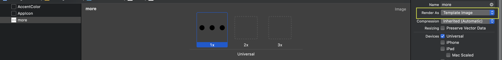

### **CollectionViewCell 안에 위치한 버튼 클릭 시 해당 셀 삭제하는 방법**

CollectionViewCell 안에 위치한 버튼을 클릭할 경우, 삭제 여부를 선택하는 alert 창을 띄우고 삭제를 진행하는 방법에 대해서 살펴보겠습니다.

아래 그림에서 보이는 하얀색 ...을 클릭하면 해당 뷰의 categoryArray에 있는 산책 오브젝트를 삭제할 계획입니다. 현재 데이터는 realm을 사용하여 저장하고 있습니다.
<div align="center">

</div>

- 먼저 해당 셀.xib 파일에서 저 ...버튼을 보여줄 버튼을 생성하고, 해당 버튼에 Assets.xcassets 안에 넣어준 이미지를 넣어줍니다. 오른쪽에 보이는 Render as 에서 **Template image**를 클릭하시면 추후 svg파일의 색상을 버튼 tintColor를 사용해 하얀색으로 변경할 수 있습니다.

    <div align="center">
    
    </div>

현재 아이콘을 1x부분에만 넣어줬지만 각 핸드폰에 따라 아이콘 픽셀이 깨지지 않으려면 2x, 3x 부분도 넣어주는 게 좋습니다. https://appicon.co/ 이 사이트에서 1024 x 1024 크기의 아이콘 하나를 넣어주면 1x, 2x, 3x 의 아이콘을 생성해주니, 사용해보시면 좋을 것 같습니다.

<div align="center">

</div>

위와 같이 테이블 셀.xib에 버튼을 생성하고, 버튼 안에 해당 아이콘을 넣어주었습니다. 이제 다음으로 해당 셀과 연결된 UICollectionViewCell.swift 파일에서 outlet을 통해 저 버튼을 연결합니다.

```swift
@IBOutlet weak var deleteButton: UIButton!
```
deleteButton이라는 이름으로 연결해주었습니다.

이제 해당 셀이 등록된 ViewController에 가서 해당 버튼을 클릭할 경우 삭제하는 alert를 보여주고, alert에서 삭제를 클릭할 경우 해당 카테고리 셀을 삭제하는 과정을 진행하면 됩니다.

<div align="center">

</div>


**어떤 카테고리의 셀에 위치한 버튼을 클릭한 것인지 알기 위해 콜렉션 뷰에서 셀을 리턴할 때 각 row에 해당하는 번호를 deleteButton의 tag에 지정해주었습니다.**

```swift
  func collectionView(_ collectionView: UICollectionView, cellForItemAt indexPath: IndexPath) -> UICollectionViewCell {
    let cell = homeCollectionView.dequeueReusableCell(withReuseIdentifier: HomeCategoryCollectionViewCell.identifier, for: indexPath) as! HomeCategoryCollectionViewCell
    cell.categoryName.text = categoryArray?[indexPath.row].name
    //추후 해당 row에 있는 카테고리를 사용하여 카테고리를 삭제할 것이므로, 이와 같은 값을 가지는 태그 생성
    cell.deleteButton.tag = indexPath.row
    cell.deleteButton.addTarget(self, action: #selector(self.showDeleteAlert), for: .touchUpInside)
    return cell
    }
```


그리고 deleteButton을 touchUpInside할 경우 showDeleteAlert 메서드를 진행하도록 이벤트를 작성해주었습니다. **showDeleteAlert 메서드가 진행될 때 인자로 클릭한 버튼을 받기 때문에 버튼의 태그를 통해 categoryArray의 몇 번째 row에 위치한 버튼이 클릭되었는 지 알 수 있습니다.**

다음은 삭제 관련 경고 메시지를 띄우고, 삭제 버튼을 클릭할 경우 해당 카테고리의 삭제 진행 및 콜렉션 뷰 reload를 진행하는 코드입니다.
```swift
    @objc func showDeleteAlert(sender: UIButton){
        let categoryItemName = self.categoryArray?[sender.tag].name ?? ""
        let alert = UIAlertController(title: "\(categoryItemName) 카테고리를 삭제하시겠습니까?", message: nil, preferredStyle: .actionSheet)
        let deleteAction = UIAlertAction(title: "삭제", style: .default, handler: { (action) in
            //선택한 카테고리를 데이터베이스에서 삭제하기
            if let categoryItem = self.categoryArray?[sender.tag] {
                do {
                    try self.realm.write {
                        self.realm.delete(categoryItem)
                        DispatchQueue.main.async {
                            self.homeCollectionView.reloadData() //데이터 리로드
                        }
                    }
                } catch {
                    print("Can't delete category \(error)")
                }
            }
        })
        let cancelAction = UIAlertAction(title: "취소", style: .cancel, handler: nil)
        alert.addAction(deleteAction)
        alert.addAction(cancelAction)
        self.present(alert, animated: true, completion: nil)
    }
```