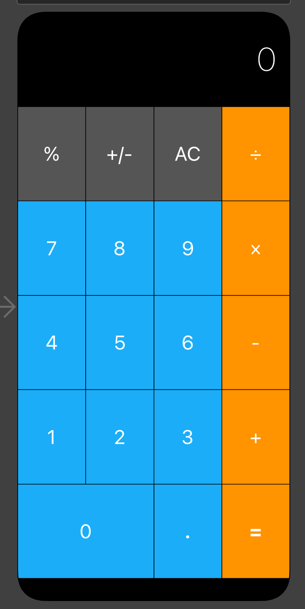
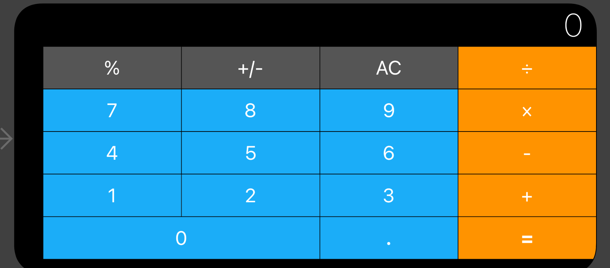
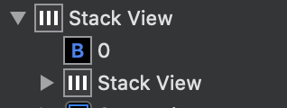

## TIL
---

**Udamy Angela Yu Swift 강의 노트**
> Auto Layout Example
<br> 스택뷰(vertical, horizontal)
전체적인 구성 → vertical stackview

<p align="center">

</p>

1. 전체를 스택뷰를 통해 일정한 높이 부여 (총 6개의 뷰를 만들고 해당 뷰를 포함하는 스택 뷰 생성) →  constraints 추가
2. 각 뷰(FirstView등)에 있는 요소를 포함하는 horizontal stack view 생성하여 각 요소가 해당 줄에서 같은 너비를 가지며 위치할 수 있도록 설정. 해당 스택뷰는 horizontal로, fill equally 적용 후 해당 스택이 이를 담고있는 FirstView와 크기 동일하도록 Constraints(위, 아래, 좌, 우 모두 0으로) 추가 → 다른 View(Second, Third ...)에서 이와 같은 행동 반복
3. 마지막 줄에선 0이 두 칸을 차지하고 . 과 = 이 한칸을 차지해야 함 → 0을 담은 stack view1 생성, -과 =를 담은 stack view2를 생성했고, 해당 stack view1과 stack view2를 담는 stack view3를 생성함 → view3에서 fill equally적용하면 각 스택뷰가 마지막 칸의 절반의 너비를 부여받아 해당 레이아웃 구현 가능. 
<p align="center">

</p>

**고칠 점**
- 요소가 한 개만 있을 경우, 해당 요소를 포함한 뷰를 생성하지 않고, 전체적인 스택 뷰를 생성할 때 다른 요소들을 담은 스택 뷰와 함께 선택하면 된다.
- 각 줄에 있는 요소를 담은 FirstView, SecondView를 만들고 또 그 안에서 해당 요소를 담은 스택뷰를 만들 필요가 없다. 바로 해당 요소들을 담은 horizontal stack view를 생성하고 전체적인 vertical stack view를 생성할 때 각 줄의 horizontal stack view를 포함시키면 됨. 즉 SecondView등은 필요없는 뷰라는 것. 처음부터 각 줄이 horizontal로 레이아웃 될 요소들이라는 것을 인지한다면, 번거롭게 일반 뷰를 생성하는 일은 일어나지 않았을 것.
- 마지막 줄의 스택을 만들 때, 굳이 0을 포함하는 스택 하나, .과 =를 포함하는 스택하나를 만들지 않아도 된다.  =과 . 의 요소를 포함하는 스택 하나만 만들고, 0과 해당 스택을 포함하는 스택에서 fill equally 적용하면 됨. 즉 스택 뷰는 뷰 안에 있는 것이 요소든 스택뷰든 상관 없음.
- 맨 위의 "0 요소"의 위치를 설정해주기 위해선, 0을 담은 뷰를 생성해서 해당 요소가 뷰에서 높이 정중앙에 위치하고, constraints 는 오른쪽으로부터 10정도 떨어지게 설정하면 된다.  

    
<br>

**구글링 프로세스 추천** :  구글에 검색(구현하고 싶은 기능 + 언어 + 어디서 찾고 싶은지(ex. stackoverflow)) → 스택오버플로우 질문과 답변 읽기 → 코드를 맞게 넣어보고 실행 → 코드에서 모르는 용어 있으면 Documentation에서 검색 → 커스터마이징


**try?를 이용한 에러 핸들링**
```swift
//throws가 적힌 함수는 에러 핸들링 해야 함.
func returInt() throws -> Int {
    return 3
}
func nothing() throws {
    print("nothing")
}

let x = try? returInt() //returnInt에서 리턴하는 값이 없으면 nil반환, 있으면 옵셔널(해당 값) 을 상수 x에 할당
let w = try? nothing()

print(x) //Optional(3)
print(w) //Optional(())

let y: Int? //옵셔널 int 형인 y 선언
//do catch이용한 에러 핸들링
do {
    y = try returInt()
} catch {
    y = nil
}
print(y) //Optional(3)

let z: Any?
do {
    z = try nothing()
} catch {
    z = nil
}
print(z) //Optional(())
```

- 유저가 클릭한 요소에 따라 다른 소리를 들려주는 기능 →<br> 유저가 클릭한 요소를 IBAction으로 받아서 해당 요소의 타이틀 값을 변수에 저장 → 소리를 출력하는 함수에 해당 타이틀 값을 인자로 넘겨주면 다른 버튼을 클릭할 때마다 다른 소리가 나오게 할 수 있다.

```swift
class ViewController: UIViewController {
    
    var player: AVAudioPlayer! //강제 언래핑
    override func viewDidLoad() {
        super.viewDidLoad()
    }
    @IBAction func keyPressed(_ sender: UIButton) {
        var letterCharacter : String = ""
        //옵셔널 값을 변수에 저장해주기 위해 옵셔널 바인딩 사용
        if let word = sender.titleLabel?.text{
            letterCharacter = word
        }
        //인자로 전달
        playSound(letter: letterCharacter)
    }
    
    func playSound(letter: String) {
        let url = Bundle.main.url(forResource: letter, withExtension: "wav")
        player = try? AVAudioPlayer(contentsOf: url!) //없으면 nil 반환
        player.play()
    }
}
```
   

- Boss challenge
    - 실로폰 버튼을 클릭하면 투명도가 0.5가 되고, 클릭 후로부터 0.2초가 지나면 다시 투명도 1로 만들기 <br>

    ```swift
    @IBAction func keyPressed(_ sender: UIButton) {
         
        var letterCharacter : String = ""
        if let word = sender.titleLabel?.text{
            letterCharacter = word
        }
        sender.alpha = 0.5 // 투명도 0.5로 변경
        // 특정 시간이 지나면 즉시 리턴하는 비동기 작업 진행
        // 두 번째 인자로 들어가는 클로저에 @escaping을 붙여줌으로써 해당 클로저가 함수 스코프를 빠져나갈 것임을 컴파일러에게 알려주기
        func delayWithSeconds(_ seconds: Double, completion: @escaping () -> ()) {
            DispatchQueue.main.asyncAfter(deadline: .now() + seconds) {
                completion() //해당 파라미터를 빠져나와서 seconds의 시간이 지나면 투명도 값 바꾸겠다
            }
        }
        //0.2초 이후애 다시 투명도를 1로 만들기
        //즉 클로저 부분 sender.alpha = 1은 0.2초가 지난 후에야 호출되는 것
        delayWithSeconds(0.2) {
            sender.alpha = 1 //escaping을 통해 함수 외부에서 클로저 정의 가능
        } 
        playSound(letter: letterCharacter)
    }
    ```
    - DispatchQueue → 앱의 기본 스레드 또는 백그라운드 스레드에서 연속 또는 동시에 태스크 실행을 관리하는 개체. <br>
    - **동기적** → 코드가 해당 항목의 실행이 완료될 때까지 기다림. <br>
    - **비동기적** → 작업 항목을 예약하면 작업 항목이 다른 곳에서 실행되는 동안 기다리지 않고 다음 코드가 계속 실행된다.

    **func asyncAfter(deadline: DispatchTime, execute: DispatchWorkItem)**
    - asyncAfter → 특정 시간에 작업항목을 예약하고 즉시 반환
    - deadline → 작업항목을 실행하도록 예약할 시간. execute→ 실행할 작업이 들어있는 항목

    **@escaping 부분**:  
    - 만약 10초 후에 투명도 값을 바꾼다고 가정하면 비동기작업으로 10초 지나면 실행할 코드를 예약. 즉 클로저 안에 있는 코드는 10초가 지나야 실행되는 것임. 비동기로 진행하니까 함수 안에서 10초 계속 기다리는 게 아니고 일단 해당 함수 빠져나와서, 그 뒤의 기능을 수행하다가 10초가 완료되면 클로저를 호출해서 원하는 기능(투명도 1로) 수행하는 것. <br>
    - 클로저를 @escaping 선언 안하면 해당 클로저는 함수 스코프 안에서만 작동해야 함. 즉 @escaping 안 붙이면 클로저를 빠져나가지 못함.<br>
    - 해당 작업(10초이후 실행)이 완료될 때까지 투명도를 바꾸는 클로저는 호출되지 않음. 스코프를 빠져나온 후(함수가 종료된 이후)에도 클로저를 메모리에 저장해 비동기 작업을 이어나감. 즉 스코프를 빠져나와도 해당 작업을 지속할 수 있음.
    
