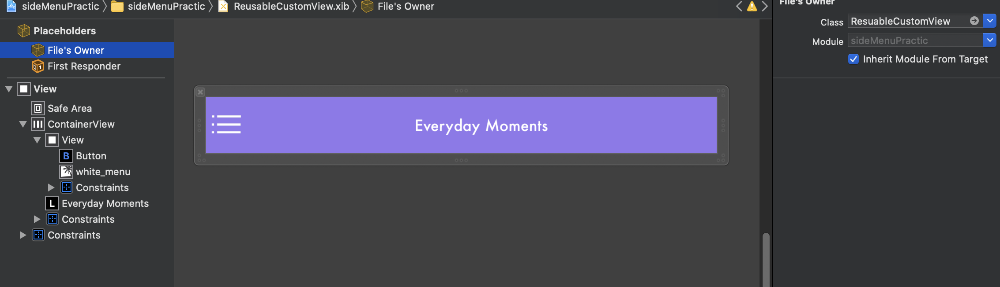
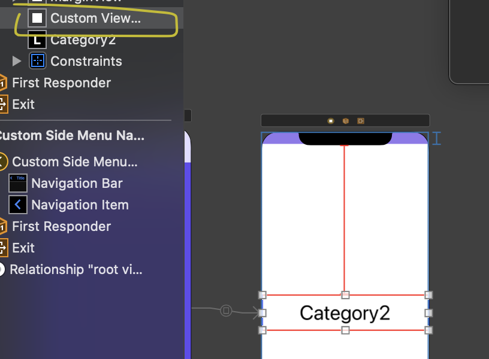
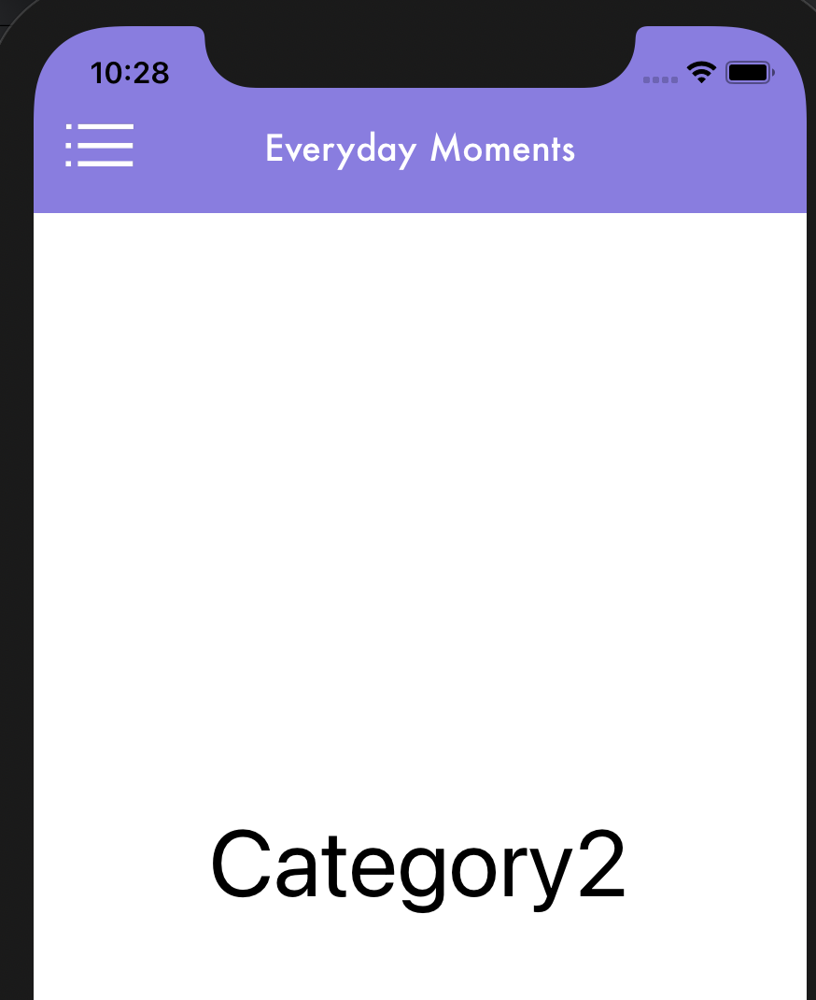

### TIL

<div align="center">

</div>

- 어제 작성한 코드(위 화면)는 home View와 category2 View에서 반복되는 윗 부분을 home의 경우 스토리보드로, category2의 경우 코드로 각각 작성했다. 두 개의 뷰에서 반복되는 윗 부분을 하나의 CustomView로 만들어서 해당 CustomView를 home의 뷰와 category2의 뷰에서 재사용하는 방법을 학습 및 적용함. [깃헙 링크](https://github.com/osandra/IOS_Practice/commit/3081d5e7ef8a619d3f2e20d08fea0753d8440972)

- extension(기능 추가)을 사용해 코드의 반복 줄이기
---

**CustomView를 만들어서 재사용하는 방법** 

- new file - View  → 파일이름.xib파일 생성
(ex. ReuableCustomView.xib)

- 해당 .xib파일에 적용할 .swift 파일 생성(ex. ReuableCustomView.swift)

- .xib에서 스타일, UI 요소 추가 및 File's Owner의 class ReuableCustomView로 지정

- ReusableCustoView.xib 사진
<div align="center">

</div>


```swift
//ReusableCustomView.swift
class ResuableCustomView: UIControl {
    let nibName = "ReusableCustomView"
    // 재사용할 셀 연결 
    // 아래에 safeArea 있는 최상위 뷰가 아니라
    // 최상위 뷰 안에 작성한 재사용할 셀을 연결
        @IBOutlet weak var containerView: UIStackView!
    required init?(coder aDecoder: NSCoder) {
            super.init(coder: aDecoder)
            commonInit()
        }

    override init(frame: CGRect) {
        super.init(frame: frame)
        commonInit()
    }
    
    func commonInit() {
        guard let view = loadViewFromNib() else { return }
        view.frame = self.bounds
        self.addSubview(view)
    }
    
    func loadViewFromNib() -> UIView? {
        let nib = UINib(nibName: nibName, bundle: nil)
        return nib.instantiate(withOwner: self, options: nil).first as? UIView
        }
    } 
```
- 해당 ResuableCustomView를 사용할 여러 개의 뷰 컨트롤러에 뷰를 생성하고 class를 ResuableCustomView로 설정
<div align="center">

</div>

- 네모친 부분이 ResuableCustomView를 사용한 셀 → 실행 시 다음과 같이 제대로 사용된 것을 확인할 수 있음

<div align="center">

</div>

- 카테고리 메뉴 버튼을 클릭하면 사이드 메뉴를 보여주는 함수를 실행하고 싶어서,xib에서 버튼이 클릭되면 실행되는 IBAction 추가함

    ```swift
    @IBAction func menuBtnClicked(_ sender: UIButton) {
            print("buttton clicked")
        }
    ```
>**문제**<br> 
→ 해당 함수 안에서 사이드 메뉴를 보여주는 함수를 작성하고 싶은데 해당 함수에 present 라는 메서드가 있어서 사용 불가 <br>→ present는 뷰 컨트롤러를 모듈식(modally)으로 제시(present) 해주는 기능이라서 View에서 사용 불가

```swift
// 사이드 메뉴를 보여주는 함수
func showSlideMenu(){
    let storyboard = UIStoryboard(name: "Main", bundle: nil)
    let sideMenuViewController: SideMenuViewController = storyboard.instantiateViewController(withIdentifier: "SideMenuViewController") as! SideMenuViewController
    let menu = CustomSideMenuNavigation(rootViewController: sideMenuViewController)
    present(menu, animated: true, completion: nil)
}

```
**해결 방법**
```swift
@IBAction func menuBtnClicked(_ sender: UIButton) {
    self.sendActions(for: .touchUpInside)
}
```

→ self.sendActions(for: .touchUpInside)를 사용해 뷰 컨트롤러에서 showSlideMenu() 액션을 받아 버튼 클릭시 해당 액션을 감지해 실행하도록 함

→ ResuableCustomView를 사용하는 뷰 컨트롤러에 다음과 같은 코드가 작성됨

```swift
//해당 customViewCell을 연결
@IBOutlet weak var customViewCell: ResuableCustomView!
//customViewCell이 touchUpInside 이벤트로 발생하면 showSlideMenu 함수 실행시킬 것임
@IBAction func customViewTapped(_ sender: ResuableCustomView) {
    self.showSlideMenu()
}
```
ResuableCustomView를 사용하는 뷰 컨트롤러에서 customViewCell을 클릭하면 showSlideMenu 메서드를 실행하는 코드를 touchUpInside 이벤트로 작성했다.
<br><br>
menuBtnClicked 함수 안의 self.sendActions(for: .touchUpInside)
는 해당 이벤트(ex touchUpInside)와 관련된 모든 작업을 전송해준다. <br>즉 touchUpInside로 설정된 action(ex showSlideMenu)등을 다 받게 해주는 것이다. 
<br><br>
즉 customViewTapped 메서드를 touchUpInside 이벤트로 작성했고, 위의 menuBtnClicked 함수에서 touchUpInside 관련 작업을 sendActions를 통해 전송받기에 해당 버튼이 클릭되면 사이드 메뉴가 보이게 된다.

---
- ResuableCustomView를 사용하는 여러 뷰 컨트롤러에서 슬라이드를 보여주는 함수를 계속 사용하므로, 이를 extension으로 기능 추가하여 사용함

```swift
//여러 뷰 컨트롤러에서 해당 함수 기능을 사용하므로, 익스텐션에 해당 기능 추가
extension UIViewController {
    func showSlideMenu(){
        let storyboard = UIStoryboard(name: "Main", bundle: nil)
        let sideMenuViewController: SideMenuViewController = storyboard.instantiateViewController(withIdentifier: "SideMenuViewController") as! SideMenuViewController
        let menu = CustomSideMenuNavigation(rootViewController: sideMenuViewController)
        present(menu, animated: true, completion: nil)
    }
}
```

[ref 1) CustomView](https://guides.codepath.com/ios/Custom-Views)

[ref 2) CustomView 2](https://suragch.medium.com/creating-custom-views-in-ios-for-multiple-reuse-b2307a57d792)