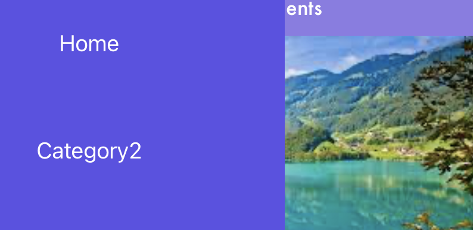
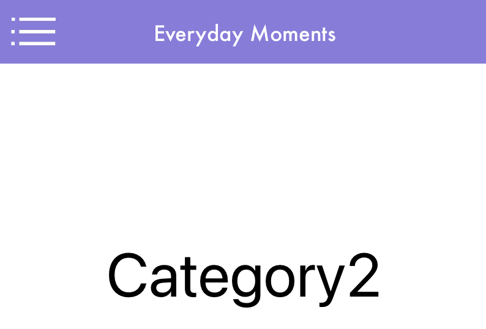

### TIL
- SideMenu 라이브러리(CocoaPods)를 사용해서 SideMenu 구현 [깃헙 링크](https://github.com/osandra/IOS_Practice/commit/1af2aabd46bc5a3c8281371dead132b5c3fdb29a)

<div align="center">

</div>

---
<div align="center">

</div>

- 슬라이드 메뉴를 열어주는 아이콘은 이미지로 넣고, 이미지와 같은 크기 및 위치의 버튼 또한 생성 → 해당 버튼을 클릭하면 slideMenu가 보이게 함

<div align="center">

</div>

- 각 카테고리 작성할 때 라벨이 아닌 버튼으로 작성해야 segue 로 다음 뷰컨트롤러에 연결된다. <br>

<div align="center">

</div>

- category2 의 View layout은 스토리보드 대신 controller 에서 코드로 레이아웃 작성해봄 <br>
→ 추후 중복되는 상단 부분을 재사용할 수 있는 방법으로 다시 리팩토링하기

    ```swift
    import UIKit

    class categoryTqoViewController: UIViewController {
        override func viewDidLoad() {
            super.viewDidLoad()
            let screenSize: CGRect = UIScreen.main.bounds
            let myView = UIView(frame: CGRect(x: 0, y: 0, width: screenSize.width, height: 90))
            myView.backgroundColor = UIColor(red: 0.54, green: 0.48, blue: 0.87, alpha: 1.00)
            self.view.addSubview(myView)
            
            //add Button
            let frameOne = CGRect(x: 10, y: 40, width: 50, height: 50)
            let button = UIButton()
            button.frame = frameOne
            button.setTitle("", for: .normal)
            button.addTarget(self, action: #selector(buttonAction), for: .touchUpInside)
            myView.addSubview(button)

            //add Image
            let slideIcon = UIImage(named: "white_menu")
            let myImageView: UIImageView = UIImageView()
            myImageView.contentMode = UIView.ContentMode.scaleAspectFit
            myImageView.frame = frameOne
            myImageView.image = slideIcon
            myView.addSubview(myImageView)

            //add Label
            let myLabel = UILabel()
            myLabel.frame = CGRect(x: 108, y: 40, width: 200, height: 50)
            myLabel.text = "Everyday Moments"
            myLabel.textAlignment = .center
            myLabel.textColor = UIColor.white
            myLabel.font = UIFont.init(name: "Futura", size: 17)
            myView.addSubview(myLabel)
        
        }
        @objc func buttonAction(sender: UIButton!) {
            // 버튼 클릭하면 다시 슬라이드 메뉴 보이게 
            let storyboard = UIStoryboard(name: "Main", bundle: nil)
            let sideMenuViewController: SideMenuViewController = storyboard.instantiateViewController(withIdentifier: "SideMenuViewController") as! SideMenuViewController
            let menu = CustomSideMenuNavigation(rootViewController: sideMenuViewController)
            present(menu, animated: true, completion: nil)     
            }
    }
    ```

[ref 1) sideMenu](https://gonslab.tistory.com/10)

[ref 2) sideMenu2](https://medium.com/cleansoftware/how-to-implement-a-side-menu-step-by-step-in-swift-5-bff998991ac0)

[ref 3) sideMenu github](https://github.com/jonkykong/SideMenu)

라이브러리를 사용하며 느낀 점: 라이브러리를 쓰지 않고 구현하는 방법도 나중에 더 익숙해지면 연습해봐야겠다. 라이브러리를 만든 사람이 업데이트된 스위프트 버전에 따라 계속 코드를 업데이트 안 해주면 작동이 어려워져, 라이브러리로 사용하던 기능을 갑자기 사용하지 못하게 될 수 있을 것 같다.