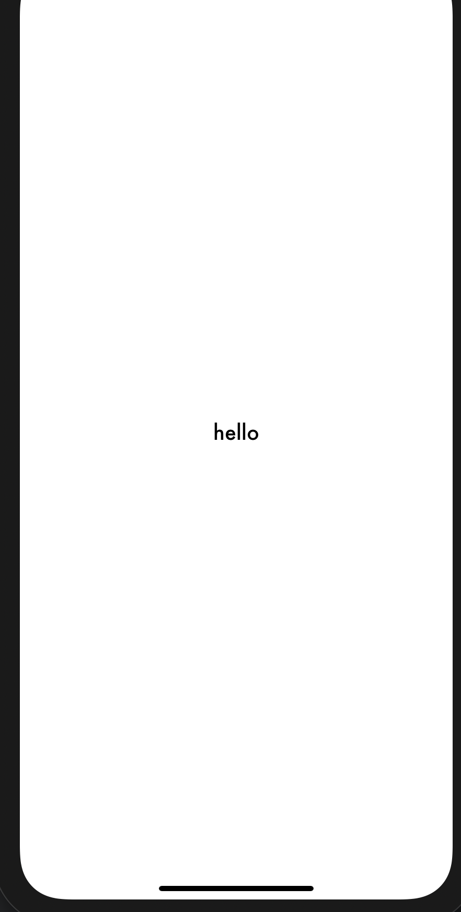
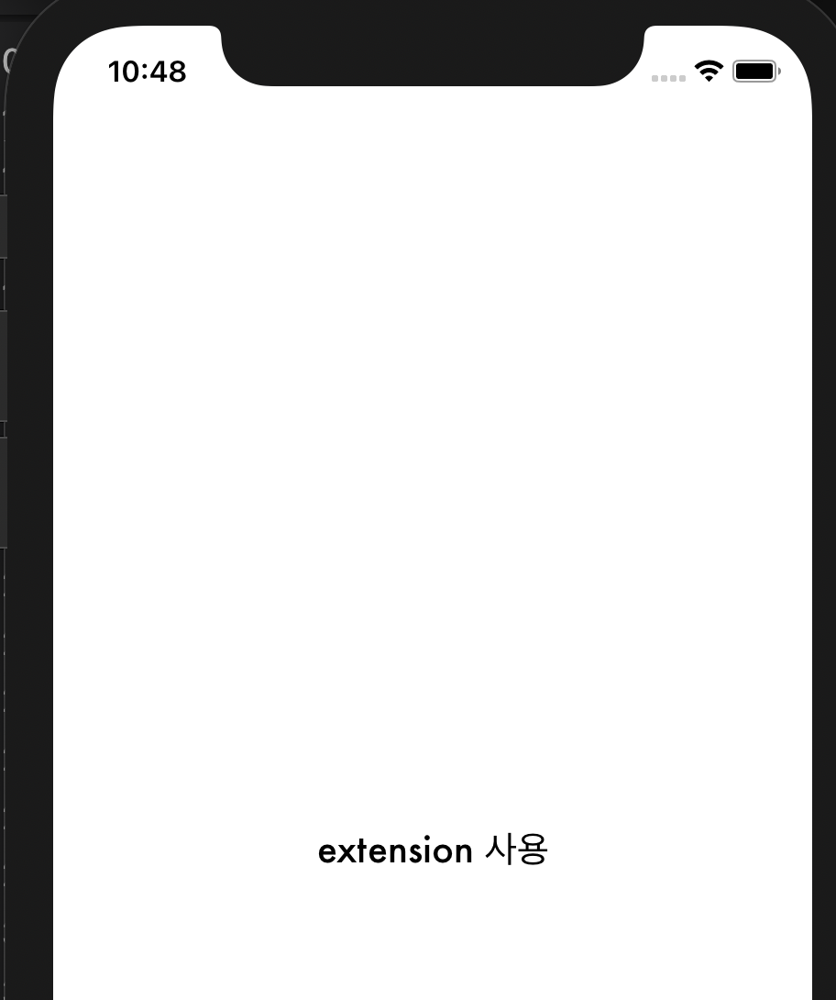

## TIL
---

### **코드를 사용하여 UILabel 생성하는 방법**
새 라벨을 생성할 때 스토리보드에서 생성한 후 outlet으로 뷰컨트롤러에 연결하여 관련 속성을 변경하는 방법과, 처음부터 뷰컨트롤러에서 코드로 라벨을 작성해서 뷰에 보여주는 방법이 있습니다.

코드로 라벨을 작성하는 여러 방법에 대해 살펴보겠습니다.

첫 번째는 UILabel()의 인스턴스를 선언해서 뷰가 로드되면 해당 라벨을 현재 뷰의 subview로 더하고, 관련 속성 및 레이아웃을 설정해주는 방법입니다.

```swift
class thirdViewController: UIViewController {
    let titleLabel = UILabel()
    override func viewDidLoad() { //뷰가 로드되면
        super.viewDidLoad()
        view.addSubview(titleLabel)
        //속성 설정
        titleLabel.text = "hello"
        titleLabel.textAlignment = .center
        titleLabel.textColor = .black
        titleLabel.font = UIFont.init(name: "Futura", size: 20)
        //레이아웃 설정
        titleLabel.translatesAutoresizingMaskIntoConstraints = false
        titleLabel.centerXAnchor.constraint(equalTo: view.centerXAnchor).isActive = true
        titleLabel.centerYAnchor.constraint(equalTo: view.centerYAnchor).isActive = true
    }
}
```
위의 코드를 실행할 경우, 뷰의 정중앙에 hello 라는 글자가 보입니다.
<div align="center">

</div>

위의 방법은 먼저 라벨을 선언하고 관련 속성(색상, 폰트)등을 설정해주는 방법이었습니다.

두 번째 방법으로는 **특정 프로퍼티를 설정한 UILabel을 리턴하는 함수를 만들고**, 이를 라벨 생성 시 사용하는 방법이 있습니다.

```swift
class secondViewController: UIViewController {
    //라벨 생성
    lazy var anotherLabel: UILabel = self.makeLabel()
    //라벨을 리턴하는 함수 makeLabel
    func makeLabel() -> UILabel {
        let label = UILabel()
            label.textAlignment = .center
            label.textColor = .black
            label.translatesAutoresizingMaskIntoConstraints = false
            label.font = UIFont.init(name: "Futura", size: 20)
            return label
    }
    override func viewDidLoad() {
        view.addSubview(anotherLabel)
        anotherLabel.text = "another"
        anotherLabel.centerXAnchor.constraint(equalTo: view.centerXAnchor).isActive = true
        anotherLabel.centerYAnchor.constraint(equalTo: view.centerYAnchor).isActive = true
    }
}
```
**그런데 위와 같은 방법은 makeLabel 함수 대신 이름 없는 함수인 클로저를 사용하면 더욱 짧게 작성할 수 있습니다.**

```swift
class secondViewController: UIViewController {
    var anotherLabel: UILabel = { //클로저 사용
        let label = UILabel()
        label.textAlignment = .center
        label.textColor = .black
        label.translatesAutoresizingMaskIntoConstraints = false
        label.font = UIFont.init(name: "Futura", size: 20)
        return label
    }()
    //-뷰에 보이게 하는 부분 위와 동일해서 생략-//
}
```

❗️ 위의 방법에서 사용한 makeLabel 메서드를 **UILabel 클래스에 기능(extension)으로 추가한다면 여러 뷰 컨트롤러에서 같은 프로퍼티 설정을 지닌 라벨을 쉽게 생성할 수 있습니다.**

즉 특정 프로퍼티를 설정한 라벨의 재사용이 가능하게 됩니다.

**UILabel 클래스 타입 자체를 통해 호출하는 함수이므로 func 앞에 정적 키워드인 static을 사용하여 타입 메소드**를 작성해보았습니다.

```swift
extension UILabel {
    static func makeLabel() -> UILabel {
        let label = UILabel()
        label.textAlignment = .center
        label.textColor = .black
        label.translatesAutoresizingMaskIntoConstraints = false
        label.font = UIFont.init(name: "Futura", size: 20)
        return label
    }
}
```
다음과 같이 특정 라벨을 리턴하는 기능을 추가한다면 뷰 컨트롤러에서 UILabel을 생성할 때 makeLabel 메서드를 사용하여 몇몇 프로퍼티를 설정한 UILabel을 생성할 수 있습니다.

```swift
class ViewController: UIViewController {
    //뷰 컨트롤러에서 makeLabel 메서드를 사용해 라벨 생성
    lazy var titleLabel: UILabel = UILabel.makeLabel()
    override func viewDidLoad() {
        view.addSubview(titleLabel)
        titleLabel.text = "extension 사용"
        titleLabel.centerXAnchor.constraint(equalTo: view.centerXAnchor).isActive = true
            titleLabel.centerYAnchor.constraint(equalTo: view.centerYAnchor).isActive = true
    }
}
```
<div align="center">

</div>
다음과 같이 동일한 라벨이 생성되어 뷰에 보이는 것을 확인할 수 있습니다❕

- [ref1) Closure based initialization](https://www.donnywals.com/using-closures-to-initialize-properties-in-swift/) 

- [ref2) Swift Lazy Initialization with Closures](https://blog.bobthedeveloper.io/swift-lazy-initialization-with-closures-a9ef6f6312c) 

- [ref3) Swift Lazy Property Initialization](https://useyourloaf.com/blog/swift-lazy-property-initialization/) 

- [ref4) tips-and-tricks-what-are-self-executing-closures](https://cocoacasts.com/tips-and-tricks-what-are-self-executing-closures)