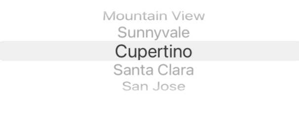
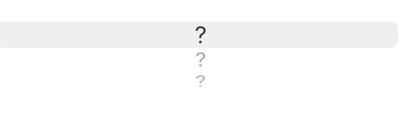
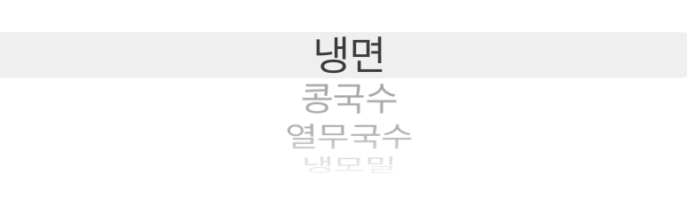
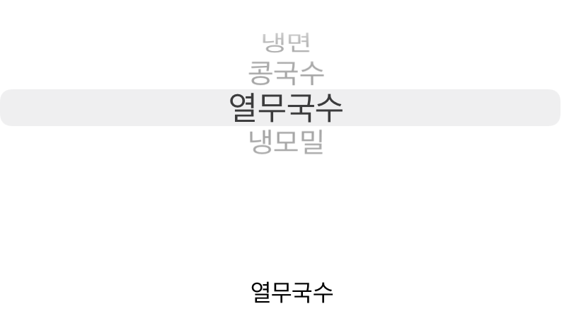
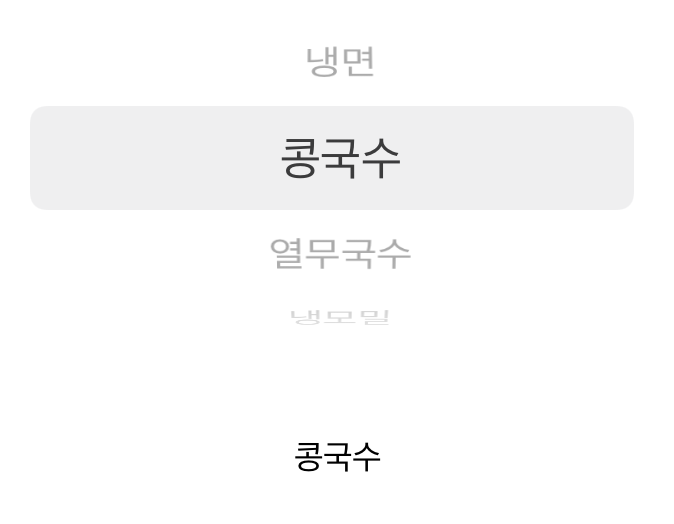

### TIL
- UIPickerView로 선택한 값에 따라 다른 데이터를 요청하고, 응답받은 데이터를  UI에 표시하는 방법
- 피보나치 리스트 반환 → 스위프트로 구현

```swift
//피보나치 리스트 반환 코드
class FiboClass {
    var list = [Int]()
    func fibonacci(n: Int){
        var number = 0
        while number <  n {
            if number == 0 {
                list.append(0)
            }
            else if number == 1 {
                list.append(1)
                
            }
            else if number >= 2 {
                let addNum = list[number-1] + list[number-2]
                list.append(addNum)
            }
            number += 1
        }
        print(list)
    }
}
let fiboTest = FiboClass()
fiboTest.fibonacci(n: 10) //[0, 1, 1, 2, 3, 5, 8, 13, 21, 34]
```
-----

### UIPickerView
<br>



- **UIPickerViewDataSource 프로토콜**을 채택해 피커뷰의 열 개수와 행의 개수를 지정할 수 있다.

    - numberOfComponents (열의 개수 지정)
    - func pickerView(_ pickerView: UIPickerView, **numberOfRowsInComponent** component: Int) -> Int 
    : 행의 개수 지정

- **UIPickerViewDelegate 프로토콜**을 채택해 사용자에게 데이터를 표시하고 사용자의 선택 항목을 알 수 있다.

> 예시
- UIPickerViewDataSource 프로토콜을 채택해 피커뷰의 열과 행 개수 지정하기
```swift
struct Menu {
    //pickerview에 표시해줄 샘플 데이터 작성
    let summerMenu = ["냉면", "콩국수", "열무국수", "냉모밀"]
}
```

```swift
class ViewController: UIViewController, UIPickerViewDataSource {
    var menu = Menu()
    //열의 개수는 한 개로 지정
    func numberOfComponents(in pickerView: UIPickerView) -> Int {
        return 1
    } 
    //행의 개수는 모델에 있는 summerMenu배열의 개수만큼
    func pickerView(_ pickerView: UIPickerView, numberOfRowsInComponent component: Int) -> Int {
        return menu.summerMenu.count
    }
    @IBOutlet weak var pickerView: UIPickerView!
    override func viewDidLoad() {
        super.viewDidLoad()
        pickerView.dataSource = self
    }
}
```
이렇게 지정하고 실행하면 다음과 같이 데이터가 들어가지 않은 채로 형식만 갖춘 피커뷰가 보인다.
<p align="center">

</p>
다음으로 사용자에게 데이터를 표시하고, 응답을 확인하기 위해  UIPickerViewDelegate를 채택해야 한다.

1. UIPickerViewDelegate **프로토콜을 채택해 사용자에게 데이터를 표시하기**

    → func pickerView(_ pickerView: UIPickerView, **titleForRow** row: Int, forComponent component: Int) -> String? (해당 메서드 사용)
    : 각 행에 표시할 텍스트를 지정할 수 있음. 유저에게 보여지는 부분. 

```swift
class ViewController: UIViewController, UIPickerViewDataSource, UIPickerViewDelegate {
    @IBOutlet weak var pickerView: UIPickerView!
    override func viewDidLoad() {
        super.viewDidLoad()
        pickerView.dataSource = self
        pickerView.delegate = self
    }
		//각 행의 데이터 표시
    func pickerView(_ pickerView: UIPickerView, titleForRow row: Int, forComponent component: Int) -> String? {
        return menu.summerMenu[row]
    }
}
```
<p align="center">

</p>

2. 사용자가 선택한 피커뷰 값 얻기

    → func pickerView(_ pickerView: UIPickerView, **didSelectRow** row: Int, inComponent component: Int)
    : 유저가 선택한 행의 번호를 알려줌 → 내부에서 행번호를 통해 선택한 행의 텍스트 값을 얻을 수 있음

```swift
func pickerView(_ pickerView: UIPickerView, didSelectRow row: Int, inComponent component: Int) {
        menuLabel.text = menu.summerMenu[row]
        menuLabel.sizeToFit()
    }
```

→ 사용자가 피커뷰 선택할 때마다 선택한 값을 알 수 있다.
<p align="center">

</p>
- 각 행의 높이 조절도 가능하다.

```swift
func pickerView(_ pickerView: UIPickerView, rowHeightForComponent component: Int) -> CGFloat {
        return 50
  }
```
<p align="center">

</p>