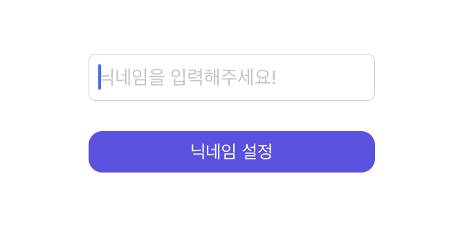
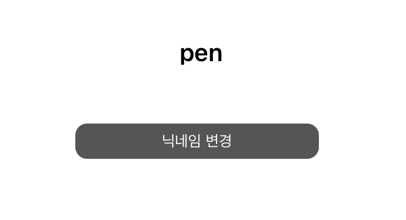
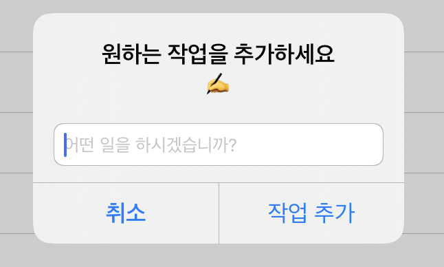
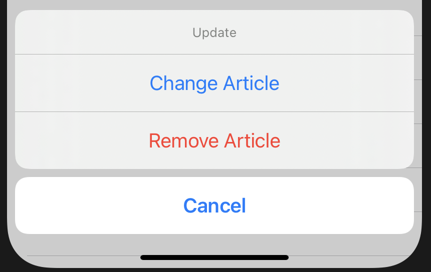

### TIL
---
**UserDefaults**: 앱 실행 내내 키-값 쌍을 지속적으로 저장하는 사용자의 기본 데이터 베이스 → 아주 작은 데이터만 저장하는 것이 적절함

**UserDefaults** 활용 사례)
- 유저 이름, 이메일 등과 같은 유저 정보 저장
- 비디오 재생 시 default volume 값
- 보안이 필요하지 않은 소량의 데이터를 저장하는 경우

**사용자에게 닉네임을 받으면, 닉네임을 바로 보여주는 예시를 통해 UserDefaults 활용해보기**

1. 사용자의 닉네임을 입력받는 textfield와 버튼을 누르면 닉네임을 저장하는 버튼이 있다.
<p align="center">
    
</p>

2. 텍스트 필드에 값을 입력하고 버튼을 누르면, 텍스트 필드는 사라지고 입력한 텍스트 값이 담긴 라벨과, "닉네임 변경"으로 변한 버튼으로 변경되는 코드를 작성했다.
<p align="center">
    
</p>

3. UserDefaults를 활용하지 않고 데이터베이스도 사용하지 않을 경우, 유저에게 **입력받은 닉네임은 앱이 백그라운드 위치에 갈 때까진 저장되지만 유저가 앱을 종료하면 해당 데이터가 없어지게 된다.**<br> 
따라서 UserDefaults를 통해 유저가 입력한 닉네임 값을 저장하면, 유저가 앱을 종료하고 다시 들어와도 그 전에 작성했던 닉네임 값을 볼 수 있게 된다
```swift
//UserDefaults에 접근
let defaults = UserDefaults.standard
//UserDefaults에 userNickName 라는 키의 이름으로 유저가 입력한 텍스트를 저장하기
defaults.set(NickTextField.text!, forKey: "userNickName")
//키를 통해 해당 키에 저장한 문자형 데이터의 값을 얻기
nickLabel.text = defaults.string(forKey: "userNickName")
```

**Source code**

```swift
import UIKit

class ViewController: UIViewController, UITextFieldDelegate {
    let defaults = UserDefaults.standard
    //유저가 닉네임을 설정할 경우, 보이게 할 닉네임 라벨 스토리보드와 연결
    @IBOutlet weak var nickLabel: UILabel!
    //유저에게 닉네임을 입력받는 textfield 연결
    @IBOutlet weak var NickTextField: UITextField!
    //닉네임 설정 및 변경 기능을 하는 버튼 연결
    @IBOutlet weak var nickBtn: UIButton!
    

    override func viewDidLoad() {
        super.viewDidLoad()
        /*ViewController가 UITextFieldDelegate 프로토콜 채택하므로 위임받았다거 선언.
        UITextFieldDelegate는 textFieldShouldReturn 등의 메서드 사용하기 위해 채택함
        */
        NickTextField.delegate = self
        //버튼 모서리 모양 둥글게
        nickBtn.layer.cornerRadius = 10
        //사용자가 닉네임을 입력하고 앱을 terminate 해도 다시 앱을 로드할 때 닉네임이 보이도록 라벨에 키 값을 넘김.
        nickLabel.text = defaults.string(forKey: "userNickName")
        showLabel()
    }
    
    // 닉네임라벨에 텍스트가 있으면, 텍스트필드를 안 보이게 하고 버튼의 텍스트와 배경색 변경하기.
    // 사용자가 앱을 처음 실행했을 때와 같이 초기 닉네임 라벨에 텍스트가 없으면 라벨을 안 보이게 하기 alpha = 0
    func showLabel(){
        if nickLabel.text == "" {
            NickTextField.alpha = 1
            nickLabel.alpha = 0
        } else {
            NickTextField.alpha = 0
            nickLabel.alpha = 1
            //버튼의 텍스트를 "닉네임 변경"으로 변경하기
            nickBtn.setTitle("닉네임 변경", for: .normal)
            //버튼 배경색 변경
            nickBtn.backgroundColor = UIColor.darkGray
        }  
    }

    //사용자가 버튼을 누를 경우
    @IBAction func BtnPressed(_ sender: UIButton) {
        saveUserNick()
        changeNick()
    }
    
    //유저가 텍스트필드에 닉네임을 입력하면 해당 값을 저장하고 창 닫기
    func saveUserNick(){
        if NickTextField.text! != "" {
            //UserDefaults에 데이터 저장
            defaults.set(NickTextField.text!, forKey: "userNickName")
            //닉네임 라벨에 저장한 값을 넣어주기
            nickLabel.text = defaults.string(forKey: "userNickName")
            //라벨 보여주기
            showLabel()
            NickTextField.endEditing(true) //키보드 창 닫기: 맨 마지막에 와야 함
        } else {
            NickTextField.endEditing(false) //사용자가 아무런 값도 입력하지 않았다면 키보드 창 닫지 않기
        }
    }
    
    //버튼의 타이틀이 "닉네임 변경"인 상태에서 버튼을 클릭하면 닉네임을 변경하는 과정을 진행하기
    func changeNick(){
        if nickBtn.titleLabel?.text == "닉네임 변경" {
            nickLabel.alpha = 0
            NickTextField.alpha = 1
            NickTextField.text = ""
            //텍스트 필드의 placeholder-> 이전에 설정한 닉네임 보여주기
            NickTextField.placeholder = defaults.string(forKey: "userNickName")
            nickBtn.setTitle("닉네임 설정", for: .normal)
            nickBtn.backgroundColor = #colorLiteral(red: 0.3654176295, green: 0.3023235202, blue: 0.9034065008, alpha: 1)
        }
    }
    
    //키보드의 return버튼을 누르기 직전에 사용자가 키보드를 통해 입력한 닉네임 저장하는 과정 거치기
    func textFieldShouldReturn(_ textField: UITextField) -> Bool {
        saveUserNick()
        return true
    }
    //텍스트 필드가 editing을 멈추기 전에 확인해야 하는 점
    func textFieldShouldEndEditing(_ textField: UITextField) -> Bool {
        if NickTextField.text == "" {
            NickTextField.placeholder = "닉네임을 입력해주세요!"
            return false
        } else {
            return true
        }
    }
}
```

----
**UIAlertController : 사용자에게 알림 메시지 표시하는 객체**

- title : 알림의 제목
- message : 알림에 대한 자세한 정보 제공
- **preferredStyle**
→ alert controller 의 스타일 결정
→ .alert와 .actionSheet 총 2가지 스타일이 있다
addTextField 메서드(텍스트 필드 창을 더하는 함수)는 alert 에서만 사용 가능하다.

UIAlertAction: alert 창에서 특정 버튼을 누를 때 실행할 작업 정의

- style: 각 액션 버튼에 적용할 스타일 종류를 결정할 수 있다.  style에는 default, cancel과 destructive 세 가지 종류가 있다.<br>
default→  기본 스타일<br>
cancel→ 작업을 취소할 때 주로 사용<br>
destructive → 작업을 변경하거나 삭제할 때 주로 사용 (색상이 빨간 색으로 표시 됨)


> UIAlertController의 preferredStyle이 alert 인 경우 예시

```swift
//+ 버튼을 클릭하면
    @IBAction func addItemClicked(_ sender: UIBarButtonItem) {
    //alert 창을 띄울 건데 해당 창에 텍스트 필드랑 작업 추가 버튼, 취소 버튼 보이게 할 것임.
    var textField = UITextField() //텍스트 필드 생성(함수 내부에서 텍스트 필드에 접근할 수 있게 해줌)
    let alert = UIAlertController(title: "원하는 작업을 추가하세요", message: "✍️", preferredStyle: .alert)
    
    let cancel = UIAlertAction(title: "취소", style: .cancel, handler: nil)
    let action = UIAlertAction(title: "작업 추가", style: .default) { (alertAction) in
        //버튼을 누르면 실행할 작업 관련 코드
        //사용자가 필드에 값을 입력해여 아이템 배열에 값을 추가
        if textField.text!.isEmptyOrWhitespace() == false {
            self.itemArray.append(Item(name: textField.text!))
            self.saveData()
        }
    }
    alert.addAction(action)
    alert.addAction(cancel)
    //텍스트필드 창 추가 -> 해당 필드에서 사용자가 입력한 값을 사용자가 action 버튼 눌렀을 때 보내주기 위해 addItemClicked 함수에 위치한 textField 변수에 해당 필드 넘기기
    alert.addTextField { (alertTextField) in
        alertTextField.placeholder = "어떤 일을 하시겠습니까?"
        textField = alertTextField
    }
    //alert 자체를 보여주기
    present(alert, animated: true, completion: nil)
}

//String 구조체에 기능 추가
extension String {
    func isEmptyOrWhitespace() -> Bool {
        // 해당 텍스트가 비었으면 true 반환
        if self.isEmpty {
            return true
        }
				//아니라면 공백을 제외한 글자 수 반환
        return (self.trimmingCharacters(in: .whitespaces) == "")
    }
}
```
<p align="center">
    
</p>

- UIAlertController의 preferredStyle이 actionSheet 인 경우 예시 (보여지는 부분만 구현)

```swift
@IBAction func addItemClicked(_ sender: UIBarButtonItem) {
    let alert = UIAlertController(title: "Update Article", message: nil, preferredStyle: .actionSheet)
    
    let change = UIAlertAction(title: "Change Article", style: .default, handler: nil)
    let remove = UIAlertAction(title: "Remove Article", style: .destructive, handler: nil)
    let cancel = UIAlertAction(title: "Cancel", style: .cancel, handler: nil)

    alert.addAction(change)
    alert.addAction(remove)
    alert.addAction(cancel)

    present(alert, animated: true, completion: nil)
    }
```

<p align="center">
    
</p>

- [출처| angela yu swift 강의](https://www.udemy.com/course/ios-13-app-development-bootcamp/)
- [참조ㅣalert](https://learnappmaking.com/uialertcontroller-alerts-swift-how-to/)
- [참조: userDefaults](https://learnappmaking.com/userdefaults-swift-setting-getting-data-how-to/)