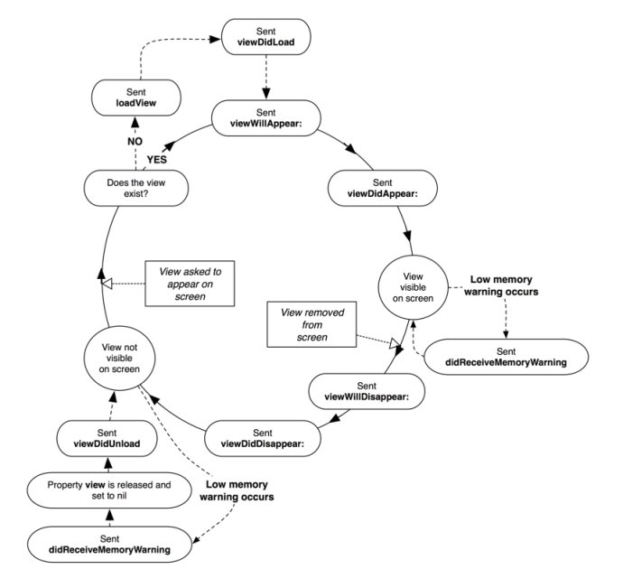
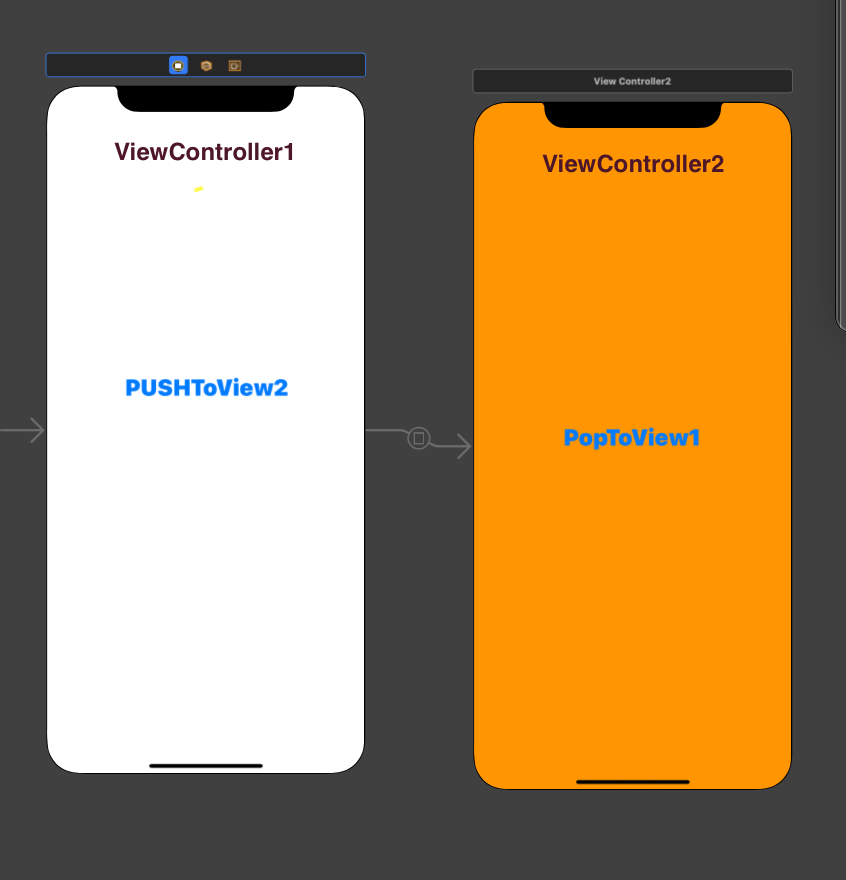

### ViewController Lifestyle

|  |
|:--:| 
| [사진 출처](https://medium.com/@vipandey54/uiviewcontroller-lifecycle-7ca2d36f4f07) |

1. **ViewDidLoad**

    **컨트롤러의 content view가 처음 memory 에 로드 되는 순간 호출된다.** 즉 view controller life cycle에서 한 번 로드되는 것이다. <br> viewController를 push하는 순간 ViewDidLoad 메서드가 호출된다. 다시 호출되기 위해선 해당 뷰컨트롤러가 pop 되어야 한다. 그 전까진 호출되지 않는다. <br>
    만약 api data가 뷰 컨트롤러의 life cycle 동안 변경될 일이 없다면 여기서 api 데이터를 호출하는 것이 좋다. 그러나 api 데이터를 자주 호출해야한다면 이곳에서 api데이터를 호출하면 안 된다.
    <p align="center">
    
    </p>

    viewController1의 **viewDidLoad 메서드는 처음 앱이 실행될 때 단 한번 호출되지만** viewController2의 **viewDidLoad 메서드는** popToView1버튼을 눌러 viewController1의 뷰가 보이고, 해당 뷰에서 다시 pushToView2 버튼을 누르면 호출된다. 즉 pop 을 통해 메모리에서 나간 후, 다시 호출될 때만 viewDidLoad 메서드가 호출되는 것이다.

2. **ViewWillAppear → content view가 유저에게 보여지기 직전에 호출된다.** <br>
    유저에게 보여지기 전에 네비게이션 바를 가리고 싶을 때 사용 가능하다. 만약 ViewDidAppear 메서드 안에서 네비게이션 바를 가리면, 네비게이션 바가 사라지는 찰나의 모습이 유저에게 보인다.

    ViewWillAppear 는 ViewDidLoad와 달리 다시 화면이 보일 때마다 실행된다. 즉 1번 뷰에서 2번 뷰로 화면이 넘어갔다가, 다시 1번 뷰로 넘어온다면 1번 뷰의  ViewWillAppear는 항상 다시 호출된다. 

    ```swift
    class LoginViewController: UIViewController {
        override func viewWillAppear(_ animated: Bool) {
                super.viewWillAppear(animated)
                navigationController?.isNavigationBarHidden = true
            }
    }
    ```
3. **ViewDidappear** → **유저에게 화면이 표시되면 호출한다.** 만약 유저에게 보여지는 시점으로부터 애니메이션을 시작하고 싶다면 해당 메서드 안에서 애니메이션 코드를 작성하면 된다.

    ```swift
    override func viewDidAppear(_ animated: Bool) {
    super.viewDidAppear(animated)
    var textIndex = 0.0
    titleLabel.text = ""
    let text = "hello world"
        //0.1초마다 한 글자씩 보여주기
        for character in text {
            Timer.scheduledTimer(withTimeInterval: 0.1 * textIndex, repeats: false) { (timer) in
                self.titleLabel.text?.append(character)
            }
            textIndex += 1
        }
    }
    ```


4. **viewWillDisappear** →  해당 뷰가 view hierarchy에서 제거되기 직전에 호출된다.<br>
    → ViewWillAppear에서 변경했던 네비게이션바 설정을 이 메서드 안에서 원래대로 되돌리는 용도로 사용 가능
5. **viewDidDisappear** →  해당 뷰가 view hierarchy에서 제거된 후 호출된다. 즉 첫 번째 뷰의 viewDidDisappear는 두 번째 뷰가 viewdidAppear한 후에 호출 됨.

**뷰 컨트롤러는 UIViewController 클래스를 상속받았으므로, 위의 메서드를  override하려면 코드를 작성하기 전에 모두 super클래스 호출해야 한다.**

[참조1) view controller lifecycle](https://medium.com/good-morning-swift/ios-view-controller-life-cycle-2a0f02e74ff5)

[참조2) view controller lifecycle](https://www.zerotoappstore.com/what-is-uiviewcontroller-lifecycle.html)