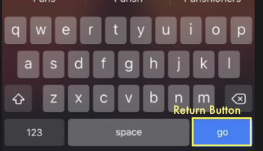

### TIL

- darkmode 에 따른 라벨 및 이미지 변경 설정
- UITextField, delegate 개념

> UITextField → 키보드를 통해 유저에게 값을 입력 받고, 중요한 작업을 처리할 위임(delegate) 개체를 할당(유저가 입력한 값을 확인, 유저가 리턴 버튼 클릭하면 인지, 유저가 endEditing하면 인지)


- **UITextField**

    - 프로퍼티 text (해당 필드가 입력한 값에 접근)
    - 메서드 func **endEditing**(_ force: Bool) -> Bool <br> true를 리턴하면 키보드를 닫아, 첫번째 응답 상태가 시작되도록 함.<br>
→ 텍스트필드.endEditing(true): 키보드를 닫겠다
    - 인스턴스 메서드 **textFieldShouldReturn**(_ textField: UITextField) -> Bool<br>
→ 리턴 버튼을 누를 때 실행되는 일을 지정하기 위해 사용. 지정하고 싶은 작업을 작성하고 true를 반환 <br>→ 즉 delegate에게 리턴 버튼을 누르기 전에 해당 작업을 진행했는지 물어봄 <br>→사용자가 키보드에서 리턴버튼을 누르면 해당 작업을 진행한 후에 리턴함
    <p align="center">
    
    </p>

    - 인스턴스 메서드 **textFieldShouldEndEditing**(_ textField: UITextField) -> Bool <br>
→ 텍스트 필드의 editing이 끝나면 user가 입력한 값을 받아들일 것인지 delegate에게 물어보는 함수. 즉 처음 응답을 받아들인 것인지 묻는 것. (사용자가 잘못된 값을 입력하면 false리턴)
    - 인스턴스 메서드 **textFieldDidEndEditing**(_ textField: UITextField) <br>
→ 텍스트필드의 처음 응답이 받아들여져서 편집이 중지되면 delegate에게 알림.

**계속 등장하는 delegate(위임)가 뭘까?**

> delegate는 **클래스나 구조체가 자신의 책임 중 일부를 다른 유형의 인스턴스에게 양도할 수 있도록 하는 설계패턴이다**. 위임할 책임(기능)등을 캡술화한 **프로토콜을 정의하고, 위임자가 해당 프로토콜을 따르면 위임한 기능을 사용할 수 있다.**

ex) UITextField라는 애플이 만든 클래스가 있다. 이 클래스는 텍스트 값을 받기도 하지만 사용자가 키보드를 입력하면서 하는 몇몇 행동들을 감지하는 기능도 있다. 사용자가 입력을 시작할 때, 사용자가 입력을 멈출 때, 사용자가 리턴 버튼을 누를 때와 같이 특정 행동을 진행했는지 확인하는 기능 등이 있다. 이렇게 여러 기능이 있다.

→ 해당 기능을 상속한다면? 만약 이를 상속받은 컨트롤러에서 사용자가 입력을 멈출 때 8자 미만 입력하면 return false를 반환한다고 오버라이딩하면 원래의 UITextField에 영향을 미친다 → **UITextField 클래스 내부는 변경되지 않고, 재사용성도 높여주게 도와주는 Delegation(위임)**

→ 즉 특정 기능(메서드)들만 모아서 위임하게 해줄 수 있다. 근데 아무나 위임받으면 안 되니까 특정 조건(protocol)을 만족하는 객체만 기능을 빌려쓸 수 있게 해줄 것임. 그럼 **뷰 컨트롤러 클래스에서 앞서 지정한 조건(프로토콜)만 채택하면 기능을 위임받을 수 있다.** 그래서 UITextField의 위임자는 **UITextFieldDelegate 프로토콜**을 따라야 함. 

→ 즉 UITextField는 delegate라는 변수를 선언했고 해당 변수를 UITextFieldDelegate 타입으로 선언했다. 그리고 해당 delegate안에 위임할 메서드를 정의해놓았다. 
→ 다른 클래스가 이를 위임받으면 위임받은 객체가 안에서 무슨 일을 하든 UITextField는 알 필요가 없다. 그냥 기능만 위임해주는 것이다. 해당 클래스에서 알아서 처리

→ **위임받은 객체는 자신이 위임받았다는 것을 선언해야 한다.** 선언해야 해당 프로토콜에 있는 메서드를 사용할 수 있음. 즉 내가 위임받았고, 프로토콜 기준도 충족했으니까 delegate안에 있는 메서드 사용하겠다고 말해줘야 함.

→ 자신이 위임받았음을 선언하면 해당 뷰 안에서 자유롭게 UITextFieldDelegate안에 있는 기능을 사용할 수 있다.

```swift
class WeatherViewController: UIViewController, UITextFieldDelegate {
//WeatherViewController는 UITextFieldDelegate 프로토콜 따름
    @IBOutlet weak var userText: UITextField!
    @IBOutlet weak var conditionImageView: UIImageView!
    @IBOutlet weak var temperatureLabel: UILabel!
    @IBOutlet weak var cityLabel: UILabel!
    
    override func viewDidLoad() {
        super.viewDidLoad()
        //delegate 선언
        //UITextField의 기능을 위임받을 객체는 WeatherViewController
        userText.delegate = self
            }
    @IBAction func searchButton(_ sender: UIButton) {
        //키보드 닫아주기
        userText.endEditing(true)
        print(userText.text!)
    }
    //키보드에서 return 버튼을 누를 때 실행되는 함수(위임받은 메서드)
    func textFieldShouldReturn(_ textField: UITextField) -> Bool {
        userText.endEditing(true)
        return true
    }
		//위임받은 메서드
    func textFieldShouldEndEditing(_ textField: UITextField) -> Bool {
        if userText.text != ""{ //모든 텍스트필드에 적용하고 싶으면 textField.text
            userText.placeholder = "search"
            return true
        } else {
            userText.placeholder = "입력하세요"
            return false
        }
    }
    // 위임받은 메서드
    func textFieldDidEndEditing(_ textField: UITextField) {
        //여기서 유저가 입력한 값을 저장받고
        
        //검색창에 아무것도 입력되지 않은 상태로 바꾸기(깨끗하게)
        userText.text = ""
    }
}
```

[참조1) Udamy Angela Yu Swif 강의](https://www.udemy.com/course/ios-13-app-development-bootcamp)

[참조2) apple UITextField 문서](https://developer.apple.com/documentation/uikit/uitextfield)

참조3) the swift programming language(swift 5.3) Ebook

[참조4)  delegation 관련 아티클](https://learnappmaking.com/delegation-swift-how-to/#why-use-delegation)