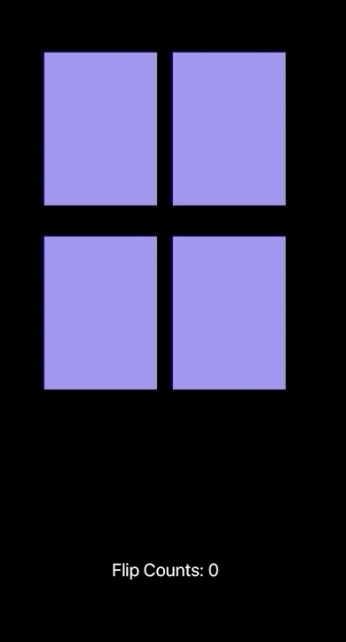

### TIL

- 같은 스와이프 기능을 두 개의 컨트롤 뷰에서 사용해야 헐 때, 해당 기능을 상위 클래스로 만들고 두 개의 컨트롤 뷰에서 이를 상속받기
- didSet 과 willSet

---

### Property Observers: 속성 값의 변화를 관찰하고 대응함 (didSet, willSet)
- 같은 값으로 재설정되더라도 호출된다.
- 정의한 저장 프로퍼티, 상속받은 저장 프로퍼티, 상속받은 계산프로퍼티에서 사용이 가능하다.

- **willSet: 새로운 값이 저장되기 직전에 호출됨**
→ 새 프로퍼티 값을 메개변수로 전달해준다. 매개변수 이름을 변경할 수 있고, 매개변수 이름을 작성하지 않으면 매개 변수가 newValue의 기본 매개 변수 이름으로 제공된다.
- **didSet: 새로운 값이 저장되자 마자 호출됨**
→ 변경되기 전의 값(이전 값)이 담긴 매개변수의 경우, 사용자가 매개변수 이름을 변경할 수 없다. 기본 매개변수 이름으로 oldValue가 사용된다.

→ 계산된 속성이 필요하지 않으며 **처음 값을 설정하고 나서 추후 다른 코드를 통해 계속 변경되는 값을 보여줘야 한다면 willSet 또는 didSet을 사용할 수 있다.**

> didSet, willSet 연습 코드
```swift
import UIKit

class Test {
    var count = 0 { //초기값 0으로 지정
        didSet {
            // count변수의 값이 변하면 아래 출력
            print("Count value is Changed! \(count)")
        }
    }
    var city = "default" {
        willSet(canChangeName) {
            // city에 새로운 값이 저장되기 직전에 호출
            // 매개변수 이름을 canChangeName로 변경가능. 해당 매개변수에는 city의 새로운 값이 전달됨
            print("new Value is \(canChangeName)")
        }
        didSet {
            // city의 값이 저장되자마자 호출됨.
            print("\(oldValue) is changed to \(city)")
        }
    }
    var testWillSet = true {
        willSet {
            // newValue: 매개변수 이름 설정 안 할 경우 기본 이름
            print("new Value is \(newValue)")
        }
    }
    
    func addCount(){
        self.count += 1
    }
    func changeCityName(){
        self.city = "Seoul"
    }
}

var example = Test()
print(example.count) //0
example.addCount() //Count value is Changed! 1

print(example.city) //default
example.changeCityName()
/*
 new Value is Seoul
 default is changed to Seoul
 */
example.testWillSet = false //new Value is false

//같은 값으로 재설정되더라도 호출됨
example.testWillSet = false //new Value is false
```

- [출처: The Swift Programming Language (Swift 5.3).” Apple Books.](https://books.apple.com/kr/book/the-swift-programming-language-swift-5-3/id881256329?l=en)

<br>
-----

### stanford ios 강의 1강 practice




→ 보여줄 버튼들을 담는 배열 선언 <br>
 @IBOutlet var cardBtns: [UIButton]! 

→ 함수 flip(emoji: String, button: UIButton) <br>: String타입의 emoji와 UIButton타입의 button전달받음<br>
버튼을 클릭했을 때, 만약 버튼의 텍스트가 전달받은 텍스트와 같으면 텍스트를 빈 문자열로 바꾸고, 배경색도 보라로 변경<br> 
텍스트가 다르면 버튼에 전달받은 이모지 텍스트를 보여주고 배경색 흰 색으로 변경

→ 버튼의 클릭을 감지하는 cardClicked 함수에 4개의 버튼을 연결함

각각 버튼을 클릭했을 때 호출되는 함수를 생성해, 그 안에서 flip 함수를 각각 호출해주면 코드 반복이 계속 발생함. <br> 
따라서 어떤 버튼을 클릭했는 지 알아내, 해당 버튼의 순서에 맞는 이모지와 함께 flip 함수를 호출하는 것이 바람직

- 방법1. 선택한 카드를 버튼의 컬렉션 배열에서 찾아서, 해당 카드의 인덱스 번호를 리턴 받음(firstIndex 메서드 사용) → 인덱스 번호를 활용해 이모지 배열에서 이모지 선택 후 flip 함수 호출

```swift
//버튼 4개 연결한 cardClicked 함수
@IBAction func cardClicked(_ sender: UIButton) {
    startCount += 1
    // firstIndex: 지정한 값이 컬렉션에 나타나는 첫 번째 인덱스를 반환
    // 즉 해당 버튼의 위치(0,1,2,3)를 받는 cardNumber
    if let cardNumber = cardBtns.firstIndex(of: sender){
        flip(emoji: emojis[cardNumber], button: sender)
    } else {
        print("card ㅑㄴ not in cards collection")
    }
} 
```

- 방법2. 버튼의 컬렉션 배열을 for문 루프로 돌아, sender(클릭한 버튼)이랑 일치하는 버튼을 찾아냄 <br>→ 해당 인덱스를 활용해 이모지 배열에서 이모지 선택 후 flip 함수 호출

```swift
//버튼 4개 연결한 cardClicked 함수
    @IBAction func cardClicked(_ sender: UIButton) {
        startCount += 1
        for i in 0..<cardBtns.count {
            if sender == cardBtns[i] {
                flip(emoji: emojis[i], button: sender)
            }
        }
    }
```

- 전체 코드
```swift
import UIKit
class ViewController: UIViewController {
    var startCount = 0 {
        didSet {
            //startCount값에 변화가 있으면 아래의 코드를 실행
            flipCount.text = "Flip Counts: \(startCount)"
        }
    }
    @IBOutlet weak var flipCount: UILabel!
    let emojis = ["🎃", "💩","🎃", "💩"]
    //outlet Collection 생성 후 뷰->카드 끌어서 4개 카드 모두 추가
    @IBOutlet var cardBtns: [UIButton]!
    override func viewDidLoad() {
        flipCount.text = "Flip Counts: 0"
    }
    //버튼 4개 연결한 cardClicked 함수
    @IBAction func cardClicked(_ sender: UIButton) {
        startCount += 1
        if let cardNumber = cardBtns.firstIndex(of: sender){
            flip(emoji: emojis[cardNumber], button: sender)
        } else {
            print("chosen card was not in card btn")
        }
    }
    func flip(emoji: String, button: UIButton){
        if (button.currentTitle == emoji){
            button.setTitle("", for: .normal)
            button.backgroundColor = UIColor(red: 0.55, green: 0.48, blue: 0.90, alpha: 1.00)
        } else {
            button.setTitle(emoji, for: .normal)
            button.backgroundColor = UIColor.white
        }
    }
}
```