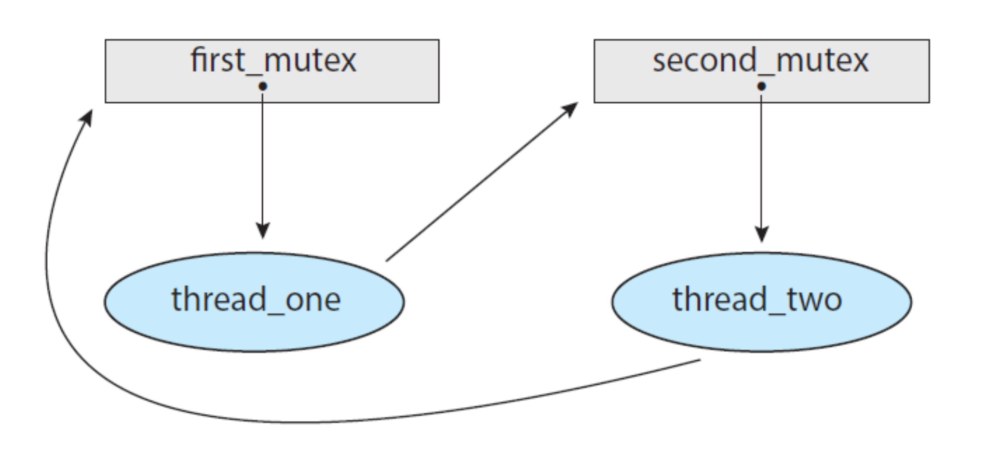
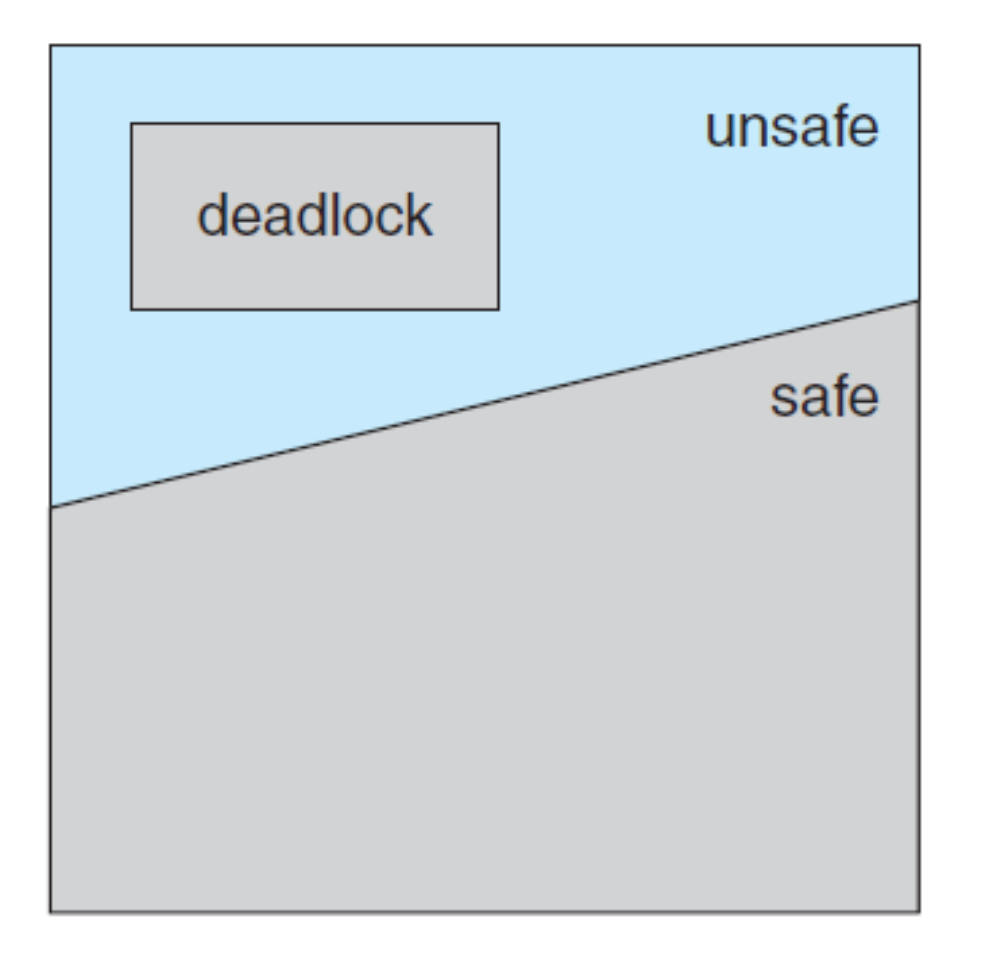
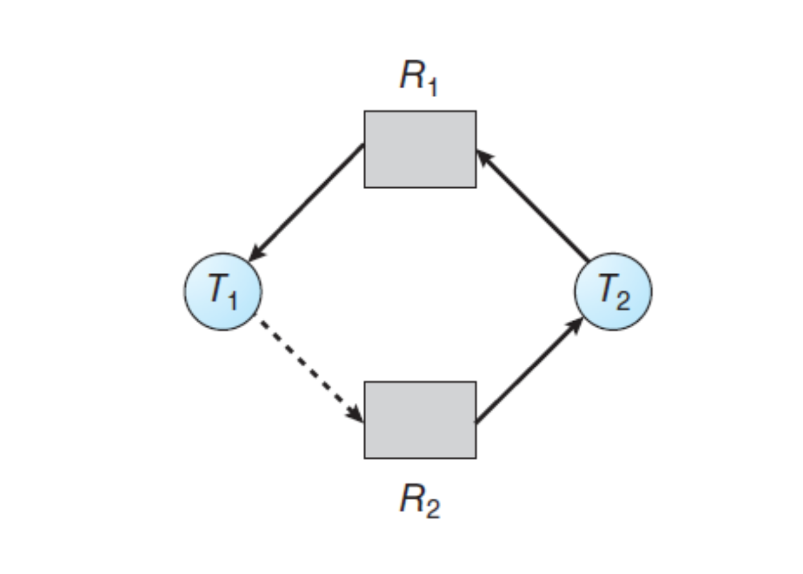

### Deadlock
교착상태: 2개 이상의 프로세스가 다른 프로세스의 작업이 끝나기만 기다리며 작업을 더 이상 진행하지 못하는 상태

**교착상태(데드락)는 한 시스템에 아래와 같은 네 가지 조건이 동시에 성립될 때 발생할 수 있다.**

1. `상호 배제 (mutual exclusion)`: 한 번에 하나의 프로세스만 자원을 사용할 수 있음.
2. `비선점 (no preemption)`: 한 프로세스가 사용중인 자원은 중간에 다른 프로세스가 빼앗을 수 없음. 즉 해당 자원을 점유하고 있는 스레드가 작업을 자발적으로 종료한 후에야 해당 자원을 얻을 수 있다.
3. `점유 대기 (hold and wait)` : 프로세스가 어떤 자원을 할당받은 상태에서 다른 자원을 기다리는 상태
4. `원형 대기(circular wait)` : 자원을 기다리는 프로세스 간에 사이클이 형성됨. 즉 쓰레드 T1,T2,T3가 있을 때 T1 은 T2가 점유한 자원을 대기하고,  T2는 T3가 점유한 자원을 대기하고 T3는 T1이 점유한 자원을 대기하는 것을 말한다.
  

👉 **자원할당 그래프(Resource Allocation Graph)**

어떤 프로세스에 자원이 할당되어 있고, 어떤 프로세스가 자원을 기다리고 있는지 파악하기 쉽게 그린 그래프다. 
`그래프는 정점 V의 집합과 간선 E`로 구성되어있다.  
`정점 V집합은 시스템 내 활성 쓰레드 집합인 T와 시스템 내 모든 자원 유형 집합인 R로 구별된다.` 
 따라서 특정 쓰레드가 어떤 자원을 선점하고 있고 어떤 자원을 대기하고 있는 지 간선의 방향을 통해 한 눈에 파악할 수 있다. 

T (쓰레드) → R(자원) 방향의 간선은 `요청 간선`으로, 해당 자원을 기다리고 있는 상태를 의미하고,

R (자원) → T(쓰레드) 방향의 간선은 `할당 간선`으로 R 의 한 인스턴스가 T에 할당된 것을 의미한다.

    

위 사진과 같이 자원할당 그래프에서 각 자원 유형이 하나의 인스턴스만 가진 상태에서 사이클을 발견한다면 데드락이 발생한 것이다.
만약 자원 유형이 여러 개의 인스턴스를 가지면 사이클이 있다고 해서 반드시 교착상태가 발생한 것은 아니다. 

------
### 👉 교착상태 해결 방법 (예방, 회피, 검출 & 회복)

**`교챡 상태 예방`**: 데드락 필요 조건 중 하나가 만족되지 않도록 하는 것

- **상호 배제 방지**: 독점적으로 사용할 수 있는 자원을 없애는 방법이다. 현실적으로 보호해야 하는 작원이 있기 때문에 어렵다.
- **비선점 방지**: 다른 프로세스가 사용중인 자원을 빼앗을 수 있도록 만드는 방법이다.  그러나 우선순위가 낮으면 빼앗긴 후 아사현상에 빠질 수 있다는 단점이 있다.
- **점유 대기 방지**: 
프로세스 시작 초기에 자신이 사용하려는 모든 자원을 한꺼번에 요청하고, 할당하는 방법이다. 따라서 스레드는 자원을 전혀 갖고 있지 않을 때만 자원을 요청할 수 있다.
그러나 짧은 시간동안만 필요한 자원을 미리 할당하기 때문에 `자원의 활용성이 떨어진다는 단점`과, 많은 자원 사용하는 프로세스는 `모든 자원을 동시 확보하기 어려워서 계속 대기`할 수 있다는 단점이 있다.
- **원형 대기 방지**: 자원에 숫자를 부여하고 숫자가 큰 방향으로만 자원을 할당하여 정해진 한 방향으로만 자원을 설정함. 그러나 `자원이 유연성이 떨어진다는 단점과 어떻게 번호를 부여할 것인지가 어렵다`는 문제가 발생한다.

**`교착 상태 회피`:**  어떤 프로세스가 자원을 요구할 때 해당 자원 제공 시 데드락 발생 가능성이 없는 경우에만 자원을 할당하는 방법이다. 이 경우엔 데드락 발생 가능성을 알기 위해 스레드가 평생 요구할 자원(최대 수)에 대한 부가적인 정보를 받아야 한다. 

이 방법에선 시스템을 safe state와 unsafe state로 나누고 `안정상태를 유지하는 선`에서만 자원을 할당한다.  불안정 상태에서 항상 교착 상태가 발생하는 것은 아니지만 데드락 발생 가능성이 있기에 해당 상태에 들어가지 않는 방법이다. 즉 안정 상태에선 데드락이 절대 발생하지 않기에 안정상태를 유지할 수 있는 범위 내에서만 자원을 할당한다.  따라서 자원이 낭비된다는 단점이 있다.

`만약 각 자원 유형이 하나의 인스턴스만 가진 상태라면 Resource Allocation Graph 사용해`서 한 프로세스가 특정 자원을 요청 할 경우, 예약 간선이라는 새로운 간선을 그리는 방법으로 할당 가능 여부를 파악한다.
점선으로 예약 간선을 표시한 다음 `해당 간선으로 인해 사이클이 형성되지 않을 때만 요청을 허용`한다. 만약 사이클이 존재하면 해당 프로세스에게 자원을 할당해주는 건 시스템을 불안정(unsafe) 한 상태로 만드는 것이기에, 자원을 제공하지 않는다.

위 사진에서 T1이 R2를 요청할 경우, T1→ R2 방향으로 예약간선을 그렸을 때 사이클이 발생하므로 프로세스는 T1에게 R2 를 할당해주지 않고 요청이 충족될 때까지 대기하게 한다.

자원의 인스턴스가 여러 개라면 `뱅커 알고리즘`을 사용해서 시스템의 안정/불안정 상태를 판단한다.

- **뱅커 알고리즘:** 
추후 데드락 발생 여부를 파악해야하기 때문에 각 프로세스는 OS에게 자신이 사용할 `자원의 최대 수(최대 자원-Max)`를 알려준다.

    각 프로세스에서 자신이 선언한 최대 자원에서 현재 할당되어 있는 자원 수를 빼면 `기대 자원(Need)`이 된다. 시스템 내 `전체 자원`에서 각 프로세스에 할당(Allocation)되고 남은 자원의 수를 `가용 자원(Available)`이라고 한다. 

    이 때 특정 스레드가 자원을 요청할 경우 
    → 요청(Request) 자원이 기대자원 보다 작거나 같으면  
    → 요청 자원이 가용 자원보다 작은 지 확인한다.   
    → 이 때 요청 자원이 가용 자원보다 작거나 같으면 시스템은 스레드에게 자원을 `할당해준 것처럼` 가용자원, 할당 자원, 기대 자원을 업데이트 한다.   
    → 이렇게 바뀐 **`상태가 안전한다면`** 프로세스는 스레드에게 실제로 자원을 할당해주고, `불안정하면 자원을 할당해주지 않고 원상태로 복원`시킨다.

    **상태가 안전한 것은 안전 순서를 발견했다는 것이다.** 안전 순서는 특정 순서에 따라 실행하면 향후 프로세스가 요청하는 최대 자원을 모두 만족시켜줄 수 있는 순서를 말한다. 
    즉 시스템의 안전 순서를 찾을 수 있다면 시스템은 안전하다고 말할 수 있다.

    따라서 한 프로세스에서 자원을 요청할 때마다 이를 제공했을 때의 결과가 안전한 상태에만 요청을 승인해준다. 
    만약 이를 제공했을 safe sequence를 발견할 수 없는 불안전한(unsafe) 상태면 할당을 안 해준다.

**`교착 상태 검출과 회복:`** 교착상태가 발생하면 이를 검출한 후 회복시키는 방법
- **교착 상태 검출 방법**
    - 자원할당 그래프 이용한 검출(리소스가 단일 인스턴스)인 경우
    - Safety  알고리즘 이용한 검출(리소스 여러개 인스턴스 인 경우): 뱅커와 비슷
- **교착 상태로 부터 회복 방법**
    - 프로세스와 스레드 종료
        - 교착 상태 일으킨 모든 프로세스 동시에 종료
        - 사이클이 제거될 때까지 교착 상태 일으킨 프로세스를 하나씩 골라 순서대로 종료
    - Resourse 선점
        1. 가장 비용이 적은 쓰레드(최근에 실행되었거나) 를 victim으로 하나 선정
        2. 해당 프로세스를 safe state로 롤백한 뒤 재시작
        3. 해당 방법은 동일한 프로세스가 계속 선정될 경우 starvation 문제가 발생함

출처

- [Deadlock Detection and Recovery in OS](https://www.studytonight.com/operating-system/deadlock-detection-and-recovery-in-os)

- [도서 쉽게 배우는 운영체제](http://www.kyobobook.co.kr/product/detailViewKor.laf?ejkGb=KOR&mallGb=KOR&barcode=9791156644071&orderClick=LAG&Kc=)

- [도서 운영체제 - 10판](http://www.kyobobook.co.kr/product/detailViewKor.laf?mallGb=KOR&ejkGb=KOR&barcode=9791185475578)

- [운영체제 강의](https://www.inflearn.com/course/%EC%9A%B4%EC%98%81%EC%B2%B4%EC%A0%9C-%EA%B3%B5%EB%A3%A1%EC%B1%85-%EC%A0%84%EA%B3%B5%EA%B0%95%EC%9D%98/)

