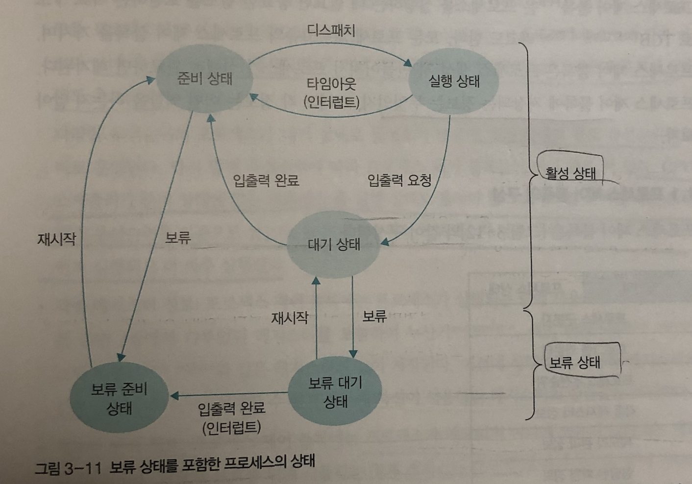

1. [프로세스](#프로세스) 
2. [스레드](#스레드)
---

폰노이만 구조에서 프로그램이 실행된다는 것은 해당 코드가 메모리로 올라와서 작업이 진행된다는 의미다.

**운영체제란?**
 하드웨어와 사용자 사이의 인터페이스 역할을 하고, 하드웨어 및 소프트웨어의 리소스 관리를 제공하는 소프트웨어다.

**멀티프로그래밍**: 하나 이상의 프로그램이 메인 메모리에 실행준비가 된 상태로 로드되어 실행할 수 있는 것을 말한다. 멀티프로그래밍의 목적은 CPU 및 기본 메모리의 활용률 저하의 문제를 해결하는 것.

**시분할 방식**: 운영체제가 cpu에 작업을 줄 때 시간을 잘게 나누어 배분하는 기법을 말한다.

**멀티태스킹**: 메모리에 여러 개의 프로세스가 위치하기 때문에 CPU가 여러 작업을 전환하며 실행하는 것을 말한다. 전환이 매우 자주 발쌩하므로 사용자 입장에서 마치 여러 개의 작업이 동시에 실행되는 것처럼 보인다.

---
### `프로세스`

**프로세스** : 실행되고 있는 프로그램을 말한다.

CPU는 한 번에 하나의 프로세스만 실행할 수 있으므로 각 프로세스는 본인을 식별할 수 있는 정보 및 작업 수행 시 필요한 정보를 담고 있는 <strong>고유한 프로세스 제어 블록(PCB)</strong>을 갖는다. PCB는 프로세스 생성 시 만들어지고 프로세스가 완료되면 사라진다.

#### **👉  프로세스 제어블록**

프로세스에서 담고 있는 정보에는 프로세스 상태, PC(프로그램 카운터), CPU 레지스터 정보, CPU 스케줄링 정보(우선순위), 메모리 관련 정보, 프로세스 계정 정보, 입출력 상태 정보 등이 있다.

#### **👉  프로세스의 메모리 레이아웃 구조**

메모리는 정적할당 영역인 크게 코드, 데이터 영역과 동적 할당 영역인 힙, 스택 영역으로 나뉜다.

→ **정적할당영역**: 실행되기 직전에 위치와 크기가 결정되고 실행되는 동안 변하지 않음

→ **둥적할당영역**: 크기가 늘어났다가 줄어들기도 하는 영역

`코드 영역`: 작성한 코드가 저장되는 영역

`데이터 영역`: 전역변수 및 static 변수가 저장되는 영역

`힙 영역`: 사용자에 의해 메모리 공간이 동적으로 할당 및 해제되는 영역이다. 동적으로 영역을 요청하기 때문에 프로세스가 돌아가는 런타임에 크기가 결정된다. (ex malloc)
힙 영역은 메모리의 낮은 주소부터 높은 주소 방향으로 할당된다.

`스택 영역`: 함수의 호출과 관계되는 지역 변수 및 매개변수가 저장되는 영역이다. 함수 실행이 끝나면 해당 영역은 소멸된다.
메모리의 높은 주소에서 낮은 주소 방향으로 할당되고 LIFO 방식을 따른다.
  
#### **👉 프로세스 상태**

`생성(Create)`: 프로세스가 메모리에 올라와 실행준비를 완료한 상태, 프로세스 제어블록을 생성함

`준비(Ready)`: 생성된 프로세스가 cpu를 얻을 때까지 기다리는 상태

`실행(Running)`: 준비상태에 있는 프로세스 중 하나가 cpu를 얻어 실제로 작업을 수행하는 상태.

`완료(Terminated)`: 프로세스가 종료되는 상태.  작업 마치면 프로세스 제어블록 사라짐. exit() or abort()→ 비정상적으로 종료되는 경우 디버깅 위해 강제 종료 직전의 메모리 상태를 저장장치로 옮기는 데 이를 코어 덤프라고 함.

`대기(Waiting)`: 입출력을 요구한 프로세스가 입출력이 완료될 때까지 기다리는 상태 → 입출력 요청한 프로세스를 실행상태에 두지 않고 대기 상태로 옮기고 완료되었다고 입출력 관리자로부터 인터럽트 받으면 준비상태로 보냄.

`휴식`: 프로세스가 일시적으로 작업을 쉬고 있는 상태

`보류`: 메모리 밖의 스왑 영역에 보관함. ex) 프로그램에 오류가 있는 경우, 메모리가 꽉 찬 경우, 실행을 미루어도 큰 지장 없는 프로세스의 경우 발생

    

#### **👉 타임아웃이란?**

cpu 스케줄러에 의해 선택된 프로세스는 실행 상태에서 일정 시간동안 작업함 → 배당된 작업 시간은 **타임 슬라이스라**고 부름. 주어진 하나의 타임슬라이스 동안 작업 끝내지 못하면 다시 준비상태로 돌아가는 데 이를 `타임아웃`이라 함. 새로운 프로세스가 실행상태로 들어오면 cpu는 타임슬라이스가 흐른 뒤 알려달라고 클록(Clock)에 요청→ 클록은 인터럽트를 사용해 알려줌. 이를 통해 타임아웃이 되면 문맥교환을 진행해야 함.

#### **👉 디스패치란?**

준비 상태의 프로세스 중 하나를 골라 실행상태로 바꾸는 cpu스케줄러의 작업을 말함. 

#### **👉 문맥교환(Conetext-Swich)이란?**

타임아웃 혹은 인터럽트가 일어났을 때 발생하는 문맥교환은 한 프로세스가 CPU를 사용중인 상태에서 해당 프로세스가 나가고 새로운 프로세스를 CPU가 사용하기 위해 필요한 정보를 보관 및 받아들이는 작업을 말한다. 즉 작업하던 프로세스의 상태를 해당 PCB에 저장하고 새로 디스패치할 프로세스의 PCB에서 상태를 가져오는 작업을 말한다.

프로세스 관련 출처

- [운영체제 강의](https://www.inflearn.com/course/%EC%9A%B4%EC%98%81%EC%B2%B4%EC%A0%9C-%EA%B3%B5%EB%A3%A1%EC%B1%85-%EC%A0%84%EA%B3%B5%EA%B0%95%EC%9D%98/lecture/63032?tab=note&speed=1.5)

- [메모리 구조](http://tcpschool.com/c/c_memory_structure)

- 도서 [쉽게 배우는 운영체제]

---
### `스레드`

**스레드**: 프로세스의 코드에 정의된 절차에 따라 CPU에 작업을 요청하는 실행 단위. 즉 프로세스 내의 실행 단위를 말한다.   스레드는 각각의 `스레드 ID, PC(프로그램 카운터), register set, stack`을 가지고,   같은 프로세스 내 있는 스레드끼리   `코드, 데이터, 파일 영역은 공유`한다. 따라서 한 스레드가 다른 스레드의 데이터를 읽고 쓸 수 있다.

👉 **프로세스와 스레드의 차이점**

- 프로세스는 독립적이고 스레드는 다른 스레드와 코드, 데이터 영역 및 리소스(파일) 을 공유한다.
- 프로세스는 별도의 메모리 공간에서 실행되지만 프로세스 내 스레드는 공유 메모리 공간에서 실행된다.

**멀티스레드**: 프로세스 내 작업을 여러 개의 스레드로 분할함으로써 작업의 부담을 줄이는 프로세스 운영 기법. 즉 프로세스를 작은 단위의 스레드로 분할하여 동시에(parallelism) 여러 작업을 수행하는 기법.

👉 **멀티 스레드의 장점**

- 응답성 향상 :한 스레드가 입출력을 인해 작업이 진행되지 않더라도 다른 스레드가 작업을 계속하여 사용자의 작업 요구에 빨리 응답할 수 있다.
- 자원 공유 : 한 프로세스 내에서 독립적인 스레드를 생성하면 프로세스가 가진 자원(코드, 데이터, 파일)을 모든 스레드가 공유하게 되어 작업을 원할하게 진행할 수 있다.
- 효율성 향상: 여러개의 프로세스를 생성하는 것과 달리 멀티스레드는 불필요한 자원의 중복 생성을 막음으로써 효율이 향상됨. 또한 프로세스간 context switch 보다 스레드간 context switch가 가볍다.
- 다중 cpu 지원: CPU 혹은 core가 여러 개인 경우, 여러 개의 프로세서에 여러 개의 스레드를 스케줄링할 수 있으므로 실행 속도가 빨라짐.
- 통신 속도: 프로세스는 프로세스 간 메모리 주소가 다르기 때문에 프로세스 간 통신(Inter-process communication) 속도가 느리다. 그러나 스레드는 동일한 프로세스에 속한 스레드와 메모리를 공유하기 때문에 스레드간 통신이 프로세스 간 통신보다 빠른 편이다.

👉 **멀티 스레드의 단점**

- 한 스레드에 문제가 생기면 전체 프로세스에 영향을 미친다.
- 같은 스레드끼리 자원을 공유하고, 동기화 문제가 발생할 수 있다. 동기화 처리가 필요한 부분은 순서 및 접근 조정 처리를 해줘야한다.

👉 **쓰레드의 두 가지 유형**

- 커널 스레드:  커널이 직접 관리하는 스레드. 운영체제에 의해 지원된다. 커널 공간에서 스레드 생성, 관리를 수행함.
- 유저 스레드:  자바 쓰레드 라이브러리와 라이브러리를 통해 사용자 공간에서 관리되는 스레드. OS에서 사용자 수준 스레드를 인식하지 못하고 커널 스레드보다 Context switch time이 적게 소요된다.

👉 **멀티쓰레딩의 3가지 타입**

- Many-to-One Model: 사용자 수준 스레드를 하나의 커널 수준 스레드에 대응. 한 번에 하나의 스레드에만 액세스 할 수 있으므로 다중 프로세서에서 여러 스레드를 병렬로 실행할 수 없다.
- One-to-One Model: 사용자 수준 스레드와 커널 수준 스레드가 일대일 관계로 대응. Many-to-One 보다 더 많은 동시성 제공함. 다중 프로세서에서 여러 스레드를 병렬로 실행할 수 있다. 단점은 사용자 스레드를 생성하기 위해 이에 대응하는 커널 스레드가 필요하다는 것임.
- Many-to-Many Model: 임의의 수의 사용자 스레드를 같거나 적은 수의 커널 스레드에 대응. 이 모델에서 개발자는 필요한 만큼 사용자 스레드 생성할 수 있고 커널 스레드는 다중 프로세서 시스템에서 병렬로 실행될 수 있다.

스레드 관련 출처

- [https://www.geeksforgeeks.org/thread-in-operating-system/](https://www.geeksforgeeks.org/thread-in-operating-system)

- [https://www.tutorialspoint.com/operating_system/os_multi_threading.htm](https://www.tutorialspoint.com/operating_system/os_multi_threading.htm)

- [https://www.backblaze.com/blog/whats-the-diff-programs-processes-and-threads/](https://www.backblaze.com/blog/whats-the-diff-programs-processes-and-threads/)

- [유저 레밸 스레드, 커널 레밸 스레드](https://www.geeksforgeeks.org/difference-between-user-level-thread-and-kernel-level-thread/)

- 도서 [쉽게 배우는 운영체제]

- [운영체제 강의](https://www.inflearn.com/course/%EC%9A%B4%EC%98%81%EC%B2%B4%EC%A0%9C-%EA%B3%B5%EB%A3%A1%EC%B1%85-%EC%A0%84%EA%B3%B5%EA%B0%95%EC%9D%98/lecture/63032?tab=note&speed=1.5)

