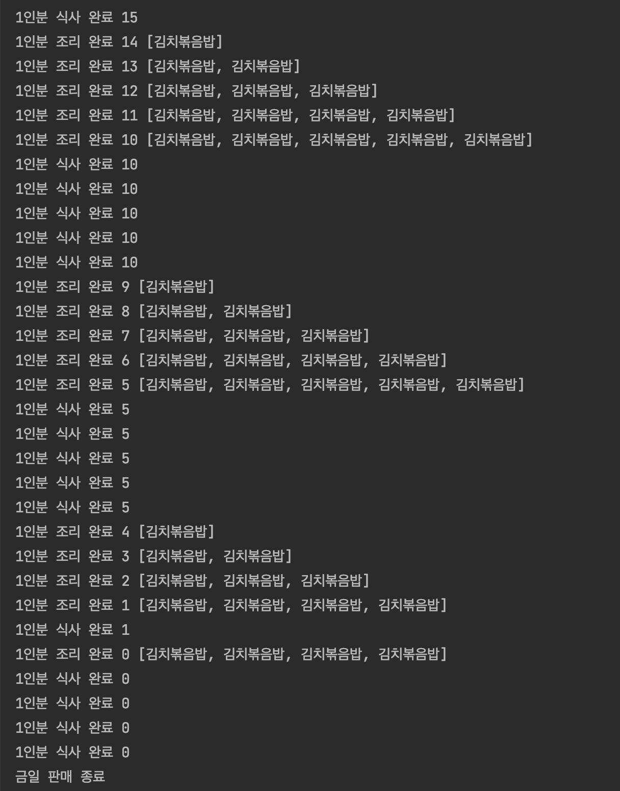

### 동기화

프로세스에서 여러 스레드를 생성해 병행적(concurrent)하게 실행하면 멀티코어의 경우 실행 속도가 빨라지는 장점이 있다. 그런데 단점 또한 있다.

같은 스레드끼리 `자원(데이터)를 공유`하므로 여러 개의 쓰레드가 병행적으로 같은 변수의 값에 접근한다면 쓰레드 문맥 교환으로 인해 `데이터의 일관성이 깨지는 동기화 문제가 발생`한다는 것이다.

프로세스의 경우, 문맥교환을 진행해도 각 프로세스는 독립적인 메모리 공간에서 실행되고, 서로 코드 및 데이터 영역을 공유하지 않으므로 서로의 데이터를 다른 프로세스가 건드리진 않는다. 

쓰레드의 동기화 문제에 대해 더 자세히 알아보자. 쓰레드의 문맥교환 시 데이터의 일관성이 깨진다는 건 무엇을 말하는 걸까? 코드 상에서 sum ++; 은 단 한 줄이지만 기계어와 대응하는 어셈블리어의 경우 해당 코드는 3단계에 걸쳐 진행된다.

1. 먼저 sum값을 register에 저장하고 (load)
2. 해당 레지스터 값 1 증가시키고 (add)
3. 해당 레지스터 값을 sum 변수를 저장하는 메모리 주소에 저장하는 3단계를 거친다. (store)

예를 들어 쓰레드 1,2가 0으로 초기화된 정적 변수인 sum에 10,000씩 더하는 코드 각각를 실행했다고 가정해보자.

그 경우에 쓰레드 1,2가 모두 실행되고 나면 sum이 20,000이 되어있지 않고 오차가 크게 발생한 15,500 , 12,050 등과 같은 값이 저장되어 있다. 그 이유는 sum을 1 증가시키는 3단계 작업 중 중간에  `context switch가 발생해서` 다른 쓰레드에서 아직 변경을 완료하지 않은 sum 값을 읽어서 더하는 작업을 진행하기 때문이다.

만약 1번 쓰레드에서 sum이 1이었을 때 2번 단계(add)를 진행하고 있었으면 레지스터에는 2가 저장되어있다.

2번을 마친 후 문맥교환이 일어나면 2번 쓰레드에선 sum 값이 1이므로 이를 2로 모두 증가시켰다고 가정하자. 그럼 이후 다시 1번 쓰레드에서 2를 sum에 저장하므로 결과적으론 1을 더하는 과정이 누락된다.

따라서 한 변수(값)을 여러 프로세스에서 접근하고 변경할 때 **실행순서에** 따라 목표한 값이 안 나오게 된다. 

이를 진행한 코드는 아래와 같다.

```java
//TestRunnable.java
public class TestRunnable implements Runnable {
    public static int sum = 0;
    @Override
    public void run() { // 쓰레드 실행 부분
        for (int k = 0; k< 10000;k++){
            sum ++;
        }
    }
}

//RaceCondition.java
public class RaceCondition {
    public static void main(String[] args) throws InterruptedException {
        Thread one = new Thread(new TestRunnable());
        Thread two = new Thread(new TestRunnable());
        one.start(); //쓰레드 시작
        two.start();
        one.join();
        two.join(); //쓰레드가 종료될 때까지 기다림
        System.out.println(TestRunnable.sum); 
        //결과 랜덤하게 숫자 나옴 ex 12050, 15508
    }
}

```

이와 같이 여러 프로세스(쓰레드)에서 공유 자원을 병행적(concurrent)으로 읽거나 쓰는 상황을 `경쟁 조건`이 발생했다고 말한다. 즉 `sum 이라는 공유자원을 one 쓰레드와 two 쓰레드에서 병행적으로 업데이트 하기 때문에 경쟁조건이 발생했다.` (만약 모든 쓰래드가 해당 값을 읽기만 한다면 문제 없다)

경쟁 조건으로 인해 값의 오차가 생기는 걸 방지하기 위해선 **`프로세스간 동기화`** 작업이 필요하다. 

- 공유 자원: 여러 프로세스가 공동으로 이용하는 변수, 메모리, 파일
- 임계구역: 공유 자원 접근 순서에 따라 실행결과가 달라지는 프로그램의 한 영역을 말한다.

---

임계 구역 문제를 해결하기 위한 세 가지 요구 조건은 다음과 같다.

1. `상호 배제:` 한 프로세스가 임계구역에 진입할 경우, 다른 프로세스가 해당 구역에 진입할 수 없게 하는 것
2. `한정 대기`: 프로세스가 무한 대기하지 않도록 하는 것. 
3. `진행 융통성`: 임계구역을 실행하고 있는 프로세스가 없으면 해당 구역을 진입하고자 하는 다른 프로세스가 진입할 수 있어야 함. (예를 들어 서로 번갈아가며 실행되어야만 하도록 코드 짠 경우는 융통성이 없는 것. 한 프로세스를 연달아 실행하기 어려우니까) ex deadlock
- 데드락: 프로세스가 살아있으나 작업을 진행하지 못하는 상태


---

임계구역 문제 해결 방안에는 피터슨, 뮤텍스 락, 세마포어, 모니터 등이 있다.

### 피터슨 알고리즘

👉 다른 프로세스가 이미 해당 구역을 사용하고 있다면 계속 대기하는 방법. flag(깃발), turn이라는 변수를 사용해 임계구역 문제를 해결하는 방법. 임계구역에 접근하고 싶으면 flag 값을 true 로 설정한다. 다른 프로세스가 구역을 사용하고 있는 건 해당 프로세스의 flag 값이 true고 turn(차례) 값을 통해 알 수 있다.

피터슨 알고리즘은 세 가지 조건(상호배제, 한정대기, 진행융통성)을 지키지만 바쁜 대기를 유발시키고 해당 알고리즘이 2개 프로세스로 국한되어있다는 단점이 있다.

```java
boolean flag[2];
int turn = 0;
flag[0] = false;
flag[1] = true;

//포로세스 0
while (true) {
 flag[0] = true; //임계구역 사용하고 싶음
 turn = 1;
 while (flag[1] && turn == 1){ 
	//다른 사람이 임계구역 사용중이면 기다림
	};

	//이제 내가 실행할 수 있음!
	//critical section
	
	// 실행 완료 했으니 깃발 내리기 
	flag[0] = false;
	// remainder section
}

//포로세스 1
while (true) {
 flag[1] = true;
 turn = 0;
 while (flag[0] && turn == 0){ 
	};
	//critical section
	flag[1] = false;
	// remainder section
}

```

### Mutex lock

👉 **임계구역에 한 번에 하나의 쓰레드만 실행**되도록 하여 상호 배제를 해결한 방법이다.

임계구역 진입하려면 `lock을 얻어야 하고, 임계구역 진행한 후 lock 반납하는 방식을 말한다.` lock을 얻는 acquice()과정과 lock을 반납하는 release() 과정이 automically(단번에) 실행 된다.

그러나 이 방법은 Busy waiting 문제가 발생한다.(다른 사람이 임계구역에 있으면 무한정 기다림) → 만약 코어가 하나인데 무한정 기다리고 있으면 문제다. 

이처럼 임계구역 진입이 불가능할 때 진입이 가능할 때까지(락을 얻을 때까지) 루프를 돌면서 시도하는 방식을 `Spinlock` 이라고 부른다. 스핀락의 장점은 진입이 가능해질 때 문맥교환 작업 없이 바로 임계구역에 진입해 작업을 진행할 수 있다는 것이다. 그러나 기다리는 시간이 너무 길어지면 CPU 의 효율을 떨어뜨린다는 단점이 있다. 따라서 멀티코어가 아닌 경우 유용하지 않다.

락을 사용한 코드는 아래와 같다.

```java
public class RaceCondition {
    public static void main(String[] args) throws InterruptedException {
        Thread one = new Thread(new TestRunnable());
        Thread two = new Thread(new TestRunnable());
        Thread three = new Thread(new TestRunnable());
        one.start();
        two.start();
        three.start();
        one.join();
        two.join();
        three.join(); //쓰레드가 종료될 때까지 기다림
        System.out.println(TestRunnable.sum); 
        ///30000 계속 출력함
    }
}

public class TestRunnable implements Runnable {
    public static int sum = 0;
    public static ReentrantLock lock = new ReentrantLock();
    @Override
    public void run() {
        lock.lock(); //acquire lock
        try {
            for (int k = 0; k < 10000; k++) {
                sum++;
            }
        } finally {
            lock.unlock(); //relase lock
        }
    }
}
```

### 세마포어

👉 lock은 오직 0 또는 1 두개의 값을 가질 수 있는 것에 반해 `세마포어는 정수 값의 변수를 사용해 동기화를 진행한다.` 만약 정수가 양수라면 임계구역에 진입이 가능한 상태인 것이고, 음수라면 진입이 불가능한 상태다. 따라서 여러 개의 공유 자원 수가 있을 때도 사용 가능하다.

세마포어 방법에선 `대기(P)와 신호(V)`를 이용해 동기화를 처리한다. 

최초에 제시된 방법은 바쁜 대기를 이용한 방법이다.<br />

`대기(P or wait):` 공유 자원의 수를 감소시킨 다음 만약 공유 자원의 수가 0보다 작다면 대기한다. <br />
`신호(V or signal):` 공유 자원의 수를 1 증가 시킨다. <br />

위와 같은 방법으로 진행한다면 공유 자원의 수가 생길 때까지 `계속 대기하는 문제`가 발생한다.<br /><br />

따라서 큐를 사용하여 이를 보완한 방법이 있다.<br />

`대기(P)`: 공유 자원의 수를 감소시킨 다음 만약 공유 자원의 수가 0보다 작다면 세마포어 큐에서 대기한다.<br />

`신호`: 공유 자원의 수를 1 증가 시킨 다음 공유 자원 수가 0 이하이면 세마포어에서 기다리는 프로세스에게 임계구역에 진입할 수 있다는 신호를 보낸다. 신호를 받은 프로세스는 레디 큐로 이동하게 된다. 즉 공유 자원 수가 0보다 큰 경우엔, 대기하고 있는 프로세스가 없으므로 신호를 보내지 않아도 된다.

예를 들어 공유 자원 수가 5개 라면 세마포어는 5개의 프로세스까지만 진입 가능하게 하고, 만약 진입 요청 시 공유 자원이 없으면 세마포어 큐에 대기하게 된다. 이후 임계구역 작업을 완료한 프로세스가 공유자원을 반환하면 신호를 보내 대기큐에 위치한 프로세스를 레디큐로 위치시킨다.


### 모니터

👉 특정 메서드를 한 번에 단 하나의 쓰레드만 실행할 수 있도록 보장해주므로 상호배제를 보장하는 방식이다. 모니터 방식에선 공유자원을 내부적으로 숨기고 공유자원에 접근하기 위한 인터페이스(synchronized) 제공함으로써 동기화를 지킨다.

쓰레드에서 모니터에 작업을 요청하면 모니터는 요청받은 작업을 모니터큐에 저장한 후 순서대로 처리한 후 그 결과만 해당 프로세스에 알려준다. 모니터는 임계구역 보호 및 동기화를 위해 내부적으로 상태 변수를 사용하며 해당 변수는 추후 메서드 안에서 실행된다.

자바에서는 임계구역에 해당하는 코드 블록 선언 시 `synchronized 키워드`를 사용하여, 쓰레드가 모니터 락을 획득해야 해당 임계구역을 진입할 수 있게 구현했다. 메서드에 synchronized 키워드를 붙일 경우 해당 메서드 자체가 임계구역으로 설정된 것이고, 현재 해당 임계구역을 진입한 객체는 this 인스턴스가 된다. 혹은 모니터락을 가진 객체 인스턴스를 파라미터로 넘겨주는 방식으로 사용할 수 있다.

동기화된 블럭 안에선 wait() 메서드를 통해 대기 상태로 진입하고, notify() 메서드를 통해 해당 객체 모니터에 대기 중인 쓰레드 하나를 깨운다. notifyAll() 메서드를 호출하면 해당 객체 모니터에 대기중인 모든 쓰레드를 깨운다.

그러나 synchronized 키워드를 남발할 경우, 한 번에 하나의 프로세스만 실행이 가능하므로 성능 저하가 발생할 수 있다는 단점이 있다.

모니터를 사용한 코드는 아래와 같다.
```java
// 같은 공유 변수에 접근해서 값을 더하는 예
// 방법1: 메서드에 키워드 사용
public class TestRunnable implements Runnable {
    static class Counter { 
        public static int sum = 0; 
        // add 메서드는 한 번에 한 프로세스만 접근 가능
        synchronized public static void add() {
            sum++;
        }
    }
    @Override
    public void run() {
        for (int k = 0; k < 10000; k++) {
            Counter.add();
        }
    }
}

//RaceCondition.java
public class RaceCondition {
    public static void main(String[] args) throws InterruptedException {
        Thread[] threads = new Thread[3];
        for (int i =0;i<3;i++){
            threads[i] = new Thread(new TestRunnable());
            threads[i].start();
        }
        for (int i =0;i<3;i++){
            threads[i].join();//쓰레드가 종료될 때까지 기다림
        }
        System.out.println(TestRunnable.Counter.sum); //30000 출력
    }
}

// 방법 2: 메서드의 특정 부분만 코드 블록으로 사용
public class TestRunnable implements Runnable {
    public static int sum = 0;
    public static Object object = new Object();
    @Override
    public void run() {
            /// do something : 동기화 작업 필요 없는 코드
            synchronized (object){
                for (int k = 0; k < 10000; k++) {
                    sum ++;
                }
            }
            /// do something
    }
}

public class RaceCondition {
    public static void main(String[] args) throws InterruptedException {
        Thread[] threads = new Thread[3];
        for (int i =0;i<3;i++){
            threads[i] = new Thread(new TestRunnable());
            threads[i].start();
        }
        for (int i =0;i<3;i++){
            threads[i].join();//쓰레드가 종료될 때까지 기다림
        }
        System.out.println(TestRunnable.sum); //30000 출력
    }
}
```
---

이번엔 음식을 조리한 다음에야 손님이 구입을 할 수 있는 코드를 작성했다. <br>조리하는 과정은 synchronized 키워드를 사용했기에 한 번에 한 쓰레드만 실행할 수 있다. 또한 한 번에 최대 5개까지 요리를 만들어 놓을 수 있다. 만약 만들어 놓은 음식이 5개라면 wait()을 통해 기다리고, 이는 추후 손님이 음식을 구입할 때 notify를 통해 호출된다.
이와 반대로 손님은 음식이 없고, 음식점의 금일 재료는 남은 상태라면 기다리고 추후 요리사가 음식을 만든 후에 notify를 통해 호출된다.

```java
//ConcurrentTest.java
package concurrent;
import java.util.LinkedList;

public class ConcurrentTest {
    static LinkedList<String> food_list = new LinkedList<>(); // 준비된 음식 리스트를 연결리스트 형태로 구현
    static int NUMBER_OF_THREADS = 50; //사용할 쓰레드 개수를 상수로 설정 ( 음식 먹는 쓰레드 50개, 음식 생성하는 쓰레드 50개로 설정함)

    static int max = 5; // 5개까지만 미리 조리 가능
    static int remaining = 150; // 오늘 판매항 음식 수량
    static Cook cook = new Cook(food_list,max); //요리를 조리하고 판매하는 기능을 제공하는 Cook 클래스

    static Thread[] eatThreads;
    static Thread[] makeTreads;

    public static void main(String[] args) throws InterruptedException {
        eatThreads = new Thread[NUMBER_OF_THREADS];
        makeTreads = new Thread[NUMBER_OF_THREADS];

        for (int i =0;i<NUMBER_OF_THREADS;i++){ //쓰레드 생성 및 시작
            eatThreads[i] = new Thread(new EatFood(cook));
            makeTreads[i] = new MakeFood(cook);
            eatThreads[i].start();
            makeTreads[i].start();
        }

        for (int i =0;i<NUMBER_OF_THREADS;i++){ //쓰레드가 끝날 때까지 기다림
            eatThreads[i].join();
            makeTreads[i].join();
        }

        System.out.println("금일 판매 종료");
    }

    public static class MakeFood extends Thread { // 음식을 만드는 기능을 호출하는 쓰레드 MakeFood
        Cook cook;
        private boolean stop = false;

        public MakeFood(Cook cook) {
            this.cook = cook;
        }

        @Override
        public void run() {
            while (!stop) {
                while (ConcurrentTest.remaining > 1) { //판매 가능 수량이 1 미만이면 음식 생성
                    cook.makeFood();
                }
                // 모두 판매했으니 쓰레드 종료시키기
                this.stop = true;
            }
        }
    }
    public static class EatFood extends Thread { // 음식을 먹는 기능을 호출하는 쓰레드 MakeFood
        Cook cook;

        public EatFood(Cook cook) {
            this.cook = cook;
        }
        private boolean stop = false;

        @Override
        public void run() {
            while (!stop) {
                while (ConcurrentTest.remaining > 0) {
                    cook.sellFood();
                }
                this.stop = true;
            }
        }
    }
}

```

```java
// Cook.java
package concurrent;

import java.util.LinkedList;

public class Cook {
    private LinkedList<String> food_list;
    private int max;

    public Cook(LinkedList<String> food_list, int max) {
        this.food_list = food_list;
        this.max = max;
    }

    synchronized void makeFood(){ //음식을 만드는 과정은 동시에 실행 X. 한 번에 하나의 음식만 만들 것임.
        try {
            while (food_list.size() == max){ // 만들어 놓을 수 있는 최대 수량을 이미 만들었으면 기다리기 -> 추후 sellFood 메서드에서 손님이 음식 하나 먹으면 신호를 받아 이후 코드 실행 가능
                wait();
            }
            if (ConcurrentTest.remaining > 0) {
                ConcurrentTest.remaining--;
                food_list.addLast("김치볶음밥");
                System.out.println("1인분 조리 완료 " + ConcurrentTest.remaining+" " + food_list); //식사 완료 문구와 재료 남은 수량, 현재 만들어놓은 음식들 출력
                notify(); // 음식이 없어서 기다리는 손님이 있으면 알려주기
            }
        } catch (InterruptedException e) {
            e.printStackTrace();
        }
    }
    synchronized void sellFood(){ //음식을 파는 과정은 동시에 실행 X. 한 번에 하나의 음식만 팔 것임.
        try {
            while(food_list.isEmpty() && ConcurrentTest.remaining > 1){ //음식이 없고, 재료는 남은 상태라면 기다리기
                wait();
            }
            if (food_list.size() > 0){
                food_list.pop();
                System.out.println("1인분 식사 완료 " + ConcurrentTest.remaining); //식사 완료 문구와 재료 남은 수량 출력
                notify();
            }

        } catch(InterruptedException e){
            e.printStackTrace();
        }
    }
}
```
아래와 같이 조리가 된 후, 식사하는 쓰레드가 실행되는 것을 볼 수 있다.
<p align="center">
    
</p>


<details>
<summary>출처</summary>

- [https://ko.wikipedia.org/wiki/피터슨의_알고리즘](https://ko.wikipedia.org/wiki/%ED%94%BC%ED%84%B0%EC%8A%A8%EC%9D%98_%EC%95%8C%EA%B3%A0%EB%A6%AC%EC%A6%98)

- [https://www.geeksforgeeks.org/petersons-algorithm-in-process-synchronization/](https://www.geeksforgeeks.org/petersons-algorithm-in-process-synchronization/)

- [https://winterbe.com/posts/2015/04/30/java8-concurrency-tutorial-synchronized-locks-examples/](https://winterbe.com/posts/2015/04/30/java8-concurrency-tutorial-synchronized-locks-examples/)

- [https://www.guru99.com/mutex-vs-semaphore.html](https://www.guru99.com/mutex-vs-semaphore.html)

- 도서 [쉽게 배우는 운영체제]

- [운영체제 강의](https://www.inflearn.com/course/%EC%9A%B4%EC%98%81%EC%B2%B4%EC%A0%9C-%EA%B3%B5%EB%A3%A1%EC%B1%85-%EC%A0%84%EA%B3%B5%EA%B0%95%EC%9D%98/)
</details>