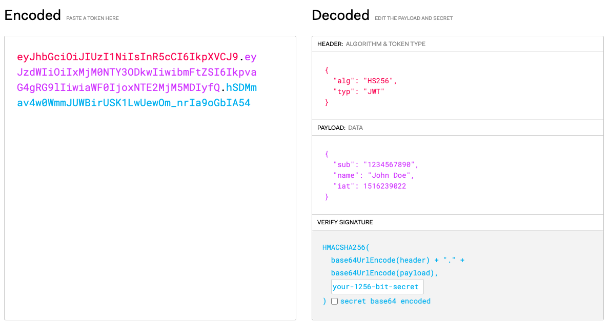

### **JWT**
---
JWT란 Json Web Token 의 약자로, 클라이언트와 서버 등 두 당사자 간에 정보를 안전하게 공유하기 위해 사용된다. 

> JWT 인증은 stateless(무상태)의 토큰 기반의 인증 방식으로, 주로 클라이언트 기반 무상태 세션으로 사용된다.

JWT를 사용하여 인증/인가를 진행할 수 있다.

1. 유저가 회원가입/로그인을 할 경우 회원 정보를 기반으로 토큰을 발급하여 클라이언트에게 전송한다 → 인증
2. 클라이언트에서 요청을 전송할 때 Authorization 헤더에 받은 토큰을 담아서 서버에게 보낸다 → 인가(권한이 있는 유저인지 확인) 
    <br> 유저를 식별해야 하는 요청에만 토큰을 함께 보내면 된다.
    <br> ex) Authorization 헤더 값에 “Bearer {토큰 값}” 을 담아서 요청
    

### **JWT 구조**

JWT는 크게 세개의 파트(헤더, 페이로드, 서명)가 .으로 구분된다.<br>
ex) xxxxx.yyyyy.zzzz (헤더값.페이로드값.서명값)

<p align="center">
<br>
<em>https://jwt.io/</em>
</p>

> 헤더(Header)

헤더는 토큰의 타입과 서명에 사용되는 알고리즘(HMAC SHA256, RSA 등) 정보가 JSON 형태로 저장되어있다.

```java
{
  "alg": "HS256",
  "typ": "JWT"
}
// HS256 서명 알고리즘을 사용하고 토큰의 타입은 JWT
// HS256는 이 토큰이 HMAC-SHA256를 사용하여 서명됨을 의미한다.
```
> 페이로드(Payload)

페이로드는 클레임(claim)을 포함하는 부분이다. 클레임(claim)은 교환하려는 정보의 집합이다. 크게 세 가지 종류의 클레임이 있다.
- Registered Claim(등록된 클레임): 등록된 클레임은 필수 사항은 아니지만 권장되는 미리 정의된 클레임 집합이다. 정의된 클레임 이름들은 모두 세글자로 구성되어있다. 해당 클레임들은 모두 선택적으로 사용할 수 있다.

    | 등록된 클레임 이름 | 설명 |
    |---|:---|
    | `iss` | 발행한 주체(issuer)|
    | `sub` | JWT 의 대상인 주체를 식별한다. 해당 값은 고유해야 한다. 따라서 유저를 식별할 수 있는 아이디나 이메일 등을 사용하여 지정할 수 있다.|
    | `exp(expiration time)` | 토큰 만료 시간 |
    | `aud(audience)` | 토큰 수령자 |
    | `nbf(not before time)` |  해당 시간 이전에는 토큰이 승인되지 않아야 한다. | 
    | `iat(issued at time)`  | 토큰이 발행된 시간 |
    | `jti(JWT ID)` |  토큰 고유 식별자 |

- Public Claim(공개 클레임):
    
    공개 클레임은 이름과 같은 일반적인 정보를 포함한다. 공개 클레임간 이름의 충돌을 방지하기 위해선 [해당 사이트에 정의되었거나](https://www.iana.org/assignments/jwt/jwt.xhtml) UUID 혹은 URL 앞에 붙여, 안전한 네임스페이스를 사용해야 한다.
    
- Private Claim(비공개 클레임):
    
    비공개 클레임은 토큰을 이용하는 두 당사자 간에 정보를 공유하기 위해 사용된다. 이 때 사용하는 클레임 이름은 공개 클레임 및 등록된 클레임에 존재하면 안된다.
    

```java
// 페이로드 예
{
    "sub": "1234567890", 
    "name": "John Doe",
    "admin": true
}
```
> 서명(Signature)

서명 부분은 JWT 토큰이 중간에 변경되는 것을 막는 용도로 사용된다. 추후 서버는 서명 부분을 통해 토큰의 유효성을 검사한다.

서명의 값은 아래의 두 단계를 거쳐 생성된다.

1. 헤더의 인코딩 값, 페이로드의 인코딩 값과 비밀키 인코딩 값을 합친다.
헤더와 페이로드는 항상 base64로 인코딩된다.
2. 합친 값을 헤더에 지정된 알고리즘으로 서명한다.

```java
HMACSHA256(
    base64UrlEncode(header) + "." +
    base64UrlEncode(payload),
    secret)
```

### 출처
---
- [https://ko.wikipedia.org/wiki/JSON_웹_토큰](https://ko.wikipedia.org/wiki/JSON_%EC%9B%B9_%ED%86%A0%ED%81%B0)
- [https://jwt.io/introduction](https://jwt.io/introduction)
- [https://techdocs.akamai.com/api-gateway/docs/json-web-token-jwt-val#jwt-claims](https://techdocs.akamai.com/api-gateway/docs/json-web-token-jwt-val#jwt-claims)
- [https://auth0.com/docs/security/tokens/json-web-tokens/json-web-token-claims](https://auth0.com/docs/security/tokens/json-web-tokens/json-web-token-claims)
- [https://blog.miniorange.com/what-is-jwt-json-web-token-how-does-jwt-authentication-work/](https://blog.miniorange.com/what-is-jwt-json-web-token-how-does-jwt-authentication-work/)