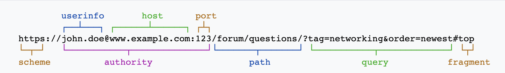

### **URI(Uniform Resource Identifier)**
**URI(리소스 자원 식벽자)는 웹 기술에서 사용되는 논리적 혹은 물리적 리소스를 식별하는 고유의 문자 시퀀스를 말한다.** URI는 아래와 같은 형태를 나타낸다.  

 
<a href="https://en.wikipedia.org/wiki/Uniform_Resource_Identifier">사진 출처</a>

- **scheme**: 주로 프로토콜을 사용한다. 프로토콜은 네트워크에서 통신할 때의 규약을 말한다. 예로 http, https, ftp, smtp 등이 있다.
- **userinfo(optional)**: URI에 사용자 정보(유저이름, 패스워드 등)를 포함하여 인증하는 것을 말한다.
- **host**: 호스트 이름 또는 IP 주소
- **port(optional)**: 생략할 경우 HTTP는 80포트, HTTPS는 443 포트를 사용한다.
- **path**: 리소스 경로이며 `/`로 구분된다.
- **query(optional)**: `?`로 시작하며 key=value의 (속성,값)쌍의 연속이다. 각 쿼리는 `&`로 구분한다.  ex) https://www.google.com/search?key1=value1&key2=value2
- **fragment(optional)**: 섹션 머리글과 같은 보조 리소스에 대한 방향을 제공한다.  
ex) https://www.inflearn.com/course/html-%EA%B8%B0%EB%B3%B8#curriculum

✓ **URI는 URL와 URN을 포함하는 개념이다.**

URL(Uniform Resource Locator)은 웹에서의 **리소스의 위치 및 주소**를 제공한다. 

URN(Uniform Resource Name)은 **특정 리소스의 접근 방법을 명시하지 않고 리소스에 대해 특정 이름으로 식별하는 것이다**. 그 예로 국제표준도서번호(ISBN)가 있다. 
urn:isbn:0-486-27557-4(urn:isbin번호)는 특정 책을 나타내지만 해당 책에 접근하기 위해 필요한 정보를 제공하지 않는다.

### 출처
- https://en.wikipedia.org/wiki/Uniform_Resource_Identifier
- https://www.javatpoint.com/uri-vs-url